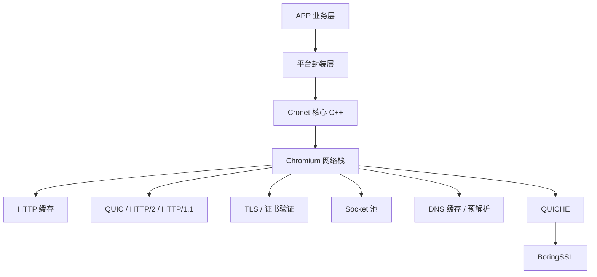

# Cronet 网络库概览

Cronet 是 Google Chromium 项目抽离出来的**跨平台网络栈**，基于 Chromium 网络栈做了封装，供 Android、iOS、C++ 客户端使用。

## 项目背景

- **出处**: 从 Chromium 提取，Google 官方维护
- **语言**: 核心 C++，各平台提供 Java/Objective-C 封装
- **支持平台**: Android, iOS, Windows, macOS, Linux
- **主要用户**: YouTube, Google App, 大量 Android APP
- **优势**: 经历 Google 亿级用户考验，性能稳定，功能齐全

## 核心特性

| 特性 | 说明 |
|------|------|
| **HTTP/2** | 原生支持，多路复用 |
| **HTTP/3 (QUIC)** | 原生支持，Google QUICHE 集成 |
| **连接复用** | 连接池复用，减少握手延迟 |
| **请求优先级** | 可以调整请求优先级 |
| **自动缓存** | HTTP 缓存实现 |
| **HTTPS 证书验证** | 完全支持，比系统默认更可靠 |
| **异步 IO** | 全异步设计，适合移动端 |
| **Brotli / gzip 压缩** | 原生支持 |
| **内存优化** | 针对移动端内存做了优化 |
| **实验框架** | 支持字段试验，方便灰度新特性 |

## 整体架构



Cronet = **Chromium 网络栈 + 包装层 + 测试工具**，方便第三方 APP 集成使用业界最先进的网络栈。

## 设计目标

1. **稳定性** → 久经考验，很少出问题
2. **性能** → 延迟、吞吐量都优化到极致
3. **一致性** → 跨平台行为一致，一份代码到处跑
4. **可集成** → 编译成静态/动态库，容易集成到 APP
5. **可配置** → 大量开关可以按需启用禁用特性

## 为什么要用 Cronet？

**比系统默认 HttpURLConnection / OkHttp 好在哪里？**

- 自带最新 HTTP/3 支持，OkHttp 现在才慢慢支持
- 连接迁移更好，移动端切换 Wifi / 4G / 5G 请求不中断
- 预解析 DNS，下次请求更快
- 连接池复用策略更成熟
- Google 自己天天用，Bug 修得快
- 已经集成好 QUIC，不用自己接

适合谁用：
- 对网络性能要求高的 APP
- 需要 HTTP/3 支持
- 需要跨平台一致网络行为

## 目录结构（源代码）

```
cronet/
├── include/
│   └── cronet.h (C API 头文件)
├── src/
│   ├── core/           # 核心逻辑
│   ├── android/        # Android Java 封装
│   ├── ios/            # iOS Objective-C 封装
│   ├── net/           # 直接复用 Chromium net 代码
│   └── build/          # 编译配置
└── tools/             # 测试工具
```

实际上 cronet 大部分核心网络代码直接复用 `chromium/src/net`，cronet 层主要做封装和 API 导出。

---

下一章：[功能模块划分](./02-modules.md)
