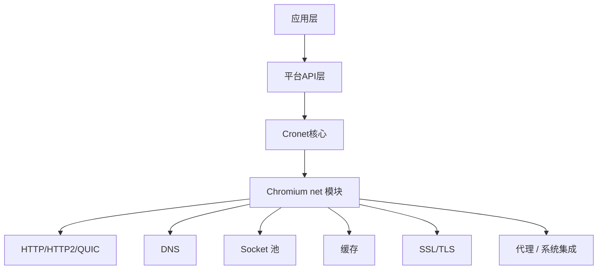

# Cronet 功能模块划分

Cronet 整体建立在 Chromium `net` 模块之上，Cronet 层做封装和导出 API。我们按分层来看：

## 分层架构



## 各层模块职责

### 1. 平台 API 层

**位置**: `cronet/android/`, `cronet/ios/`

**职责**:
- 给 Java (Android) 提供 `CronetEngine`、`UrlRequest` 等 API
- 给 Objective-C (iOS) 提供 `CRN...` 风格 API
- JNI 桥接，把 Java 调用转到 C++ 核心
- 回调转发，把 C++ 结果转成 Java/OC 回调

**为什么要这层？** 方便原生 APP 集成，不用自己写 JNI。

---

### 2. Cronet 核心封装层

**位置**: `cronet/core/`

**职责**:
- 定义 C API `cronet/include/cronet.h`
- 封装 Chromium net 的复杂对象，简化对外接口
- 处理生命周期管理
- 实验配置接口
- 统计和埋点接口

**设计要点**: 把 Chromium 非常复杂的网络栈浓缩成简单 API，让第三方好集成。

---

### 3. URL 请求模块 (`url_request/`)

这是 Chromium net 最核心的模块，Cronet 主要对外就是这个接口。

**职责**:
- `UrlRequest` — 单个URL请求对象
- `UrlRequestContext` — 请求上下文，管理连接池、缓存、共享配置
- 处理请求生命周期：Start → Read → Response → Complete
- 回调接口 `UrlRequestDelegate` 通知应用状态

---

### 4. HTTP 协议栈

**职责**:
- HTTP/1.0 / HTTP/1.1 实现
- HTTP/2 实现，多路复用，头部压缩
- HTTP/3 实现，基于 QUICHE
- Upgrade 处理
- 重定向处理

HTTP/3 这块直接依赖 Google QUICHE，就是我们上一篇整理的那个。

---

### 5. QUIC / HTTP/3 模块

**职责**:
- 集成 Google QUICHE
- 会话管理
- 连接迁移处理
- 0-RTT 握手支持
- 禁用/启用开关

Cronet 是 QUIC 最早大规模商用的客户端，这块经验非常丰富。

---

### 6. DNS 模块

**职责**:
- DNS 解析
- DNS 缓存 → 相同域名不用每次解析
- DNS 预解析 → 预判用户要访问哪个域名，提前解析
- 支持 DoH (DNS-over-HTTPS)
- 支持异步解析

优化点：预解析能省几百毫秒延迟，对移动端很有用。

---

### 7. Socket 池和连接管理

**职责**:
- 保持空闲连接，下次请求可以复用
- LRU 淘汰策略
- 限制最大连接数
- 按域名分组，同一个域名复用连接

连接复用好处：不用每次重新 TCP 握手 + TLS 握手，省很多延迟。

---

### 8. HTTP 缓存模块

**职责**:
- 实现 HTTP 缓存语义（Cache-Control, ETag, Last-Modified）
- 内存缓存 + 磁盘缓存
- 分段缓存，支持大文件
- 缓存验证，304 回复处理

节省带宽，加快重复访问速度。

---

### 9. TLS / 证书验证模块

**职责**:
- TLS 握手
- 证书链验证
- 支持 TLS 1.3
- 证书透明度验证
- 支持自定义根证书

Cronet 用 BoringSSL，比系统 OpenSSL 版本新，支持更多新特性。

---

### 10. 代理模块

**职责**:
- 支持 HTTP 代理
- 支持 SOCKS 代理
- PAC 脚本处理
- 系统代理配置读取

方便用户在代理环境使用。

---

### 11. 统计和日志模块

**职责**:
- 请求延迟统计
- 缓存命中率统计
- QUIC 成功率统计
- 错误日志
- 支持自定义打点

方便 APP 做网络监控。

---

### 12. 实验框架

**职责**:
- 支持字段试验，不同用户开不同特性
- A/B 测试新特性
- 灰度发布，风险可控

Chromium 一直这么玩，Cronet 继承了这个能力。

---

## 模块依赖关系

```
平台 API → 核心封装 → URLRequest → HTTP 协议 → Socket 池 → TCP / QUIC
URLRequest → DNS 解析 → 系统 DNS / DoH
URLRequest → HTTP 缓存 → 磁盘 / 内存
HTTP/3 → QUICHE → BoringSSL
```

都是单向依赖，结构清晰。

---

## 对比 OkHttp (Android)

| 特性 | Cronet | OkHttp |
|------|--------|--------|
| HTTP/2 | ✅ | ✅ |
| HTTP/3 | ✅ 原生集成完整 | 逐步支持中 |
| QUIC 连接迁移 | ✅ 完整 | 一般 |
| DNS 预解析 | ✅ | 需要自己做 |
| 连接池优化 | ✅ 亿级用户打磨 | ✅ 不错 |
| HTTP 缓存 | ✅ 完整语义 | ✅ |
| 跨平台 | C++ / Java / OC | Java 主要 |
| 二进制大小 | 较大 (~6-8MB 压缩后) | 小 |

如果你的 APP 对网络延迟要求很高，又需要 HTTP/3，Cronet 是更好的选择。如果要体积小，OkHttp 够了。

---

上一章：[项目概览](./01-overview.md)
下一章：[核心数据结构](./03-data-structures.md)
