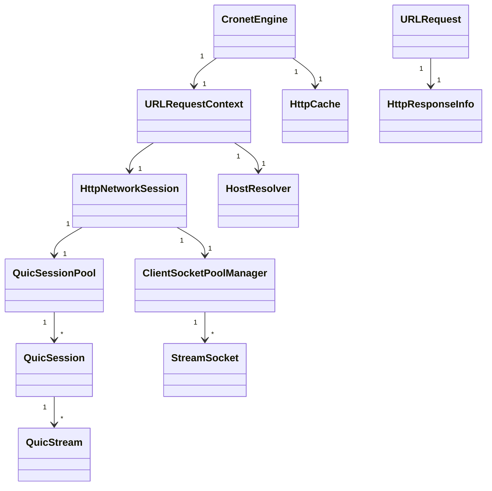

# Cronet 核心数据结构

Cronet 核心代码复用 Chromium `net` 模块，这里整理最顶层最重要的几个数据结构。

## 顶级入口: `CronetEngine`

Java (Android) 层：

```java
public class CronetEngine {
    // 全局上下文，管理连接池、缓存、DNS
    private final CronetEngineImpl mImpl;

    // 创建新请求
    public UrlRequest.Builder newUrlRequestBuilder(
        String url,
        UrlRequest.Callback callback,
        Executor executor
    ) { ... }

    // 查询统计
    public String getStatString() { ... }
}
```

C++ 层：

```cpp
class CronetEngine {
    // 持有 Chromium net 的 URLRequestContext
    std::unique_ptr<URLRequestContext> url_request_context_;
    // 连接池
    HostResolver* host_resolver_;
    HttpNetworkSession* http_network_session_;
    // HTTP 缓存
    std::unique_ptr<HttpCache> http_cache_;
    // 配置
    CronetConfig config_;
};
```

**一句话理解**：`CronetEngine` 是整个引擎的根，所有请求共享这个对象的连接池、缓存、DNS 缓存。**一个 APP 一个实例**就够了。

---

## 请求对象: `UrlRequest`

```cpp
class UrlRequest {
    // 请求上下文
    URLRequestContext* context_;
    // URL
    GURL url_;
    // 请求方法 GET / POST 等
    std::string method_;
    // 请求头
    HttpRequestHeaders request_headers_;
    // 优先级
    RequestPriority priority_;
    // 状态机
    RequestStatus status_;
    // 回调给应用
    UrlRequestDelegate* delegate_;
    // 当前响应信息
    HttpResponseInfo response_info_;
    // 读取响应数据缓冲区
    IOBuffer* read_buffer_;
    int read_buffer_size_;
    // 是否已经被取消
    bool cancelled_;
};
```

每个 HTTP 请求对应一个 `UrlRequest` 对象，生命周期从创建到完成结束。

**重要属性**：优先级，可以告诉 Cronet 哪个请求更重要，先处理哪个。

---

## HTTP 网络会话: `HttpNetworkSession`

```cpp
class HttpNetworkSession {
    // 全局配置
    HttpNetworkSessionParams params_;
    // 客户端 socket 池 → 复用连接
    ClientSocketPoolManager socket_pool_manager_;
    // QUIC 会话池
    QuicSessionPool quic_session_pool_;
    // TLS 配置
    SSLConfig ssl_config_;
    // 代理配置
    ProxyConfig proxy_config_;
};
```

这是**所有连接的管理者**：
- TCP 连接放 `ClientSocketPool`
- QUIC 会话放 `QuicSessionPool`
- 新请求过来先找池子里有没有空闲可用的连接，复用比新建快多了

---

## QUIC 会话: `QuicSession`

```cpp
class QuicSession : public Session {
    // 底层 QUIC 连接，就是 Google QUICHE 的 QuicConnection
    std::unique_ptr<QuicConnection> connection_;
    // 加密握手
    std::unique_ptr<CryptoHandshakeInterface> crypto_handshake_;
    // 所有活跃流
    std::map<QuicStreamId, std::unique_ptr<QuicStream>> streams_;
    // 会话是否可用
    bool ready_;
};
```

一个 QUIC 连接对应一个 `QuicSession`，多个 HTTP 请求多路复用到这个连接上，每个请求一个 `QuicStream`。

---

## 流对象: `QuicStream`

```cpp
class QuicStream : public Stream {
    QuicSession* session_;
    QuicStreamId id_;
    // 发送缓冲区
    std::unique_ptr<QuicStreamSendBuffer> send_buffer_;
    // 接收缓冲区
    std::unique_ptr<QuicStreamReceiveBuffer> recv_buffer_;
    // 流数据消费者 → HTTP 层
    QuicStreamVisitor* visitor_;
};
```

对应 HTTP/3 一个请求/响应，就是我们在 Google QUICHE 文档里讲的流模型。

---

## HTTP 缓存: `HttpCache`

```cpp
class HttpCache {
    // 内存缓存
    std::unique_ptr<MemoryBackend> memory_backend_;
    // 磁盘缓存
    std::unique_ptr<DiskBackend> disk_backend_;
    // 置换算法 → LRU
    ...
};
```

遵循 HTTP 标准缓存语义：
- 检查 Cache-Control 头
- 处理 max-age
- 处理 ETag / Last-Modified 验证
- 返回 304 缓存命中

---

## DNS 解析: `HostResolver`

```cpp
class HostResolver {
    // DNS 缓存
    base::LRUCache<HostKey, AddressList> cache_;
    // 预解析队列
    std::priority_queue<PreResolveTask> pre_queue_;
    // DoH 配置
    bool enable_doh_;
    std::string doh_server_;
};
```

拿到域名 → 查询缓存 → 命中直接返回 IP → 没命中异步去解析 → 存缓存。

---

## 客户端 Socket: `StreamSocket`

TCP 连接封装：

```cpp
class StreamSocket {
    //  socket fd
    int socket_fd_;
    // 地址
    IPEndPoint peer_address_;
    // TLS 连接
    SSL* ssl_;
    // 连接状态
    bool connected_;
};
```

就是对底层 TCP socket + TLS 的封装。

---

## 响应信息: `HttpResponseInfo`

```cpp
struct HttpResponseInfo {
    // HTTP 状态码 200 / 404 / 500
    int status_code;
    // 响应头
    HttpResponseHeaders* headers;
    // 是否来自缓存
    bool was_cached;
    // 用的什么协议 HTTP/1.1 / HTTP/2 / HTTP/3
    NextProto connection_protocol;
    // 证书信息
    scoped_refptr<X509Certificate> ssl_certificate;
};
```

请求完成后给应用的响应信息都在这里。

---

## 结构关系总图



---

## 设计特点

1. **共享上下文** → `CronetEngine` 全局一份，连接池缓存都共享，效率高
2. **每个请求一个 `UrlRequest`** → 生命周期清晰，互不干扰
3. **分层抽象** → 不同协议 TCP / QUIC 都实现统一接口，上层不用管细节
4. **智能指针管理生命周期** → C++ 代码用 `scoped_refptr` 自动管理，不容易 leak

---

上一章：[功能模块划分](./02-modules.md)
下一章：[请求生命周期状态机](./04-request-statemachine.md)
