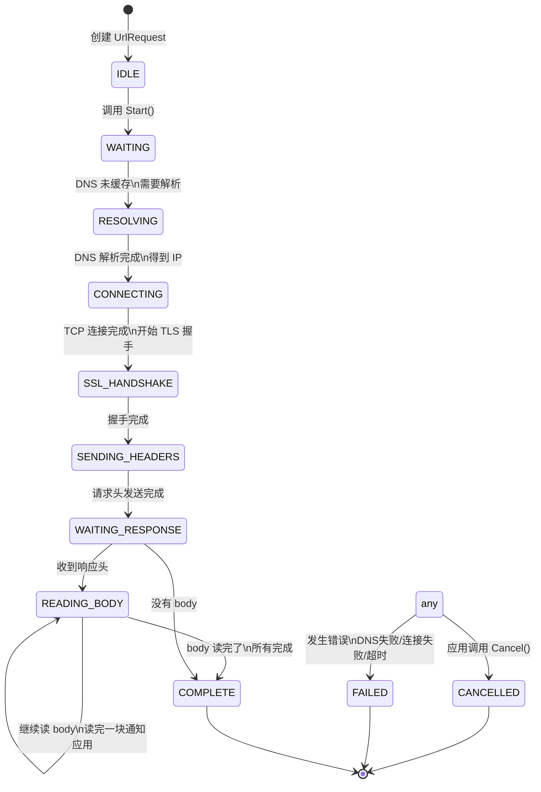

# Cronet 请求生命周期状态机

每个 `UrlRequest` 从创建到完成有一个清晰的状态机流转，理解了这个就理解了 Cronet 请求处理流程。

## 状态定义

```cpp
enum class RequestStatus {
    IDLE = 0,          // 刚创建，还没开始
    WAITING = 1,       // 等待资源（连接、DNS）
    CONNECTING = 2,    // 正在连接
    SSL_HANDSHAKE = 3, // TLS 握手
    SENDING_HEADERS = 4, // 发送请求头
    WAITING_RESPONSE = 5, // 等待响应
    READING_BODY = 6,    // 读取响应 body
    COMPLETE = 7,        // 请求完成
    CANCELLED = 8,       // 已取消
    FAILED = 9,          // 失败
};
```

## 完整状态转移图



## 各个状态详解

### 1. IDLE

刚调用 `newUrlRequestBuilder` 创建完请求，还没调用 `Start()`。

**做什么**：
- 保存 URL、method、headers、callback
- 什么也不做，等你调用 `Start()`

**何时转出**：调用 `request->Start()` → `WAITING`

---

### 2. WAITING

开始请求了，等待资源可用。

**做什么**：
- 检查缓存，看看能不能直接满足
- 如果缓存命中且有效 → 直接返回缓存响应 → 跳到 `COMPLETE`
- 如果不命中 → 需要网络请求 → 等连接池空闲连接或者新建连接

**转出：**
- 缓存命中 → `COMPLETE`
- 需要网络，DNS 已经缓存 → `CONNECTING`
- DNS 没缓存 → 需要异步解析 → `RESOLVING`

---

### 3. RESOLVING（DNS 解析中）

**做什么**：
- 调用 DNS 解析（系统 DNS 或者 DoH）
- 拿到 IP 地址列表

**转出**：
- 解析成功 → `CONNECTING`
- 解析失败 → `FAILED`

---

### 4. CONNECTING（建立连接）

**做什么**：
- 从连接池找空闲连接 → 找到了直接用，不用新建
- 找不到空闲 → 新建 TCP 连接 → 三次握手
- 如果是 QUIC → 新建 QUIC 会话 → 开始握手

**转出**：
- TCP 连接建立完成 → `SSL_HANDSHAKE`
- QUIC 会话创建 → `SSL_HANDSHAKE`（QUIC 握手在这里做）
- 连接失败 → `FAILED`

---

### 5. SSL_HANDSHAKE（TLS 握手）

**做什么**：
- 客户端发 ClientHello
- 服务器回 ServerHello 证书
- 验证证书
- 导出密钥

**转出**：
- 握手成功 → `SENDING_HEADERS`
- 握手失败（证书错/不支持版本） → `FAILED`

---

### 6. SENDING_HEADERS（发送请求头）

**做什么**：
- 组装请求头：method + URL + headers + body 长度
- 发送给服务器

**转出**：
- 发送完成 → `WAITING_RESPONSE`
- 发送失败 → `FAILED`

---

### 7. WAITING_RESPONSE（等待响应）

**做什么**：
- 等服务器发回响应头
- 响应头回来 → 解析状态码、headers

**转出**：
- 收到完整响应头 → 调用 `callback->OnResponseStarted()` → `READING_BODY`
- 没有 body → 直接 `COMPLETE`
- 超时/连接断开 → `FAILED`

---

### 8. READING_BODY（读取响应 body）

**做什么**：
- 收到一块数据 → 调用 `callback->OnReadCompleted()`
- 应用拿到数据处理完 → 调用 `request->Read()` 读下一块
- 循环直到读完

**转出**：
- 读完所有数据 → `callback->OnSucceeded()` → `COMPLETE`
- 读取出错 → `FAILED`

---

### 9. COMPLETE

请求成功完成，生命周期结束。

所有资源可以释放了。

---

### 10. CANCELLED

应用主动调用 `Cancel()` → 请求立刻停止，资源释放。

---

### 11. FAILED

出错了，错误码放在 `NetError` 里，通知应用：`callback->OnFailed()`。

---

## 缓存命中特殊路径

如果请求命中缓存，而且缓存新鲜不需要验证：

```
IDLE → WAITING → COMPLETE
```

直接返回缓存数据，不走网络，超快。这就是缓存的意义。

---

## 连接复用路径

如果连接池有空闲 keep-alive 连接：

```
WAITING → CONNECTING (直接用现有连接) → SSL_HANDSHAKE (已经做过了，跳过) → SENDING_HEADERS
```

省掉了 TCP 三次握手 + TLS 握手，至少省了 1-RTT，好几百毫秒。

---

## QUIC 特殊路径

QUIC 可以 0-RTT 握手：

```
RESOLVING → CONNECTING → 0-RTT 就绪 → SENDING_HEADERS 直接发
```

不用等服务器回 Finished，第一个包就能带应用数据，省一个 RTT。

---

## 重定向处理

如果响应是 3xx 重定向，Cronet 会自动 follow：

```
WAITING_RESPONSE → 拿到 302 → 释放当前请求资源 → 创建新请求到新 URL → 从头走一遍状态机
```

默认 follow 最多 10 次重定向，可以配置。

---

## 应用回调时机对应状态

| 回调方法 | 状态 |
|----------|------|
| `OnResponseStarted` | 进入 `READING_BODY` 之前 |
| `OnReadCompleted` | 每次读完一块数据 |
| `OnSucceeded` | 进入 `COMPLETE` 之后 |
| `OnFailed` | 进入 `FAILED` 之后 |
| `OnCanceled` | 进入 `CANCELLED` 之后 |

---

## 常见错误状态

常见失败原因：

| 错误码 | 说明 |
|--------|------|
| `ERR_NAME_NOT_RESOLVED` | DNS 解析失败 |
| `ERR_CONNECTION_REFUSED` | 连接被拒绝 |
| `ERR_CONNECTION_TIMED_OUT` | 连接超时 |
| `ERR_SSL_PROTOCOL_ERROR` | TLS 协议错误 |
| `ERR_CERT_INVALID` | 证书无效 |
| `ERR_BAD_HTTP_STATUS` | 非法 HTTP 状态码 |
| `ERR_INTERNET_DISCONNECTED` | 网络断开 |

---

上一章：[核心数据结构](./03-data-structures.md)
下一章：[完整请求处理流程](./05-full-flow.md)
