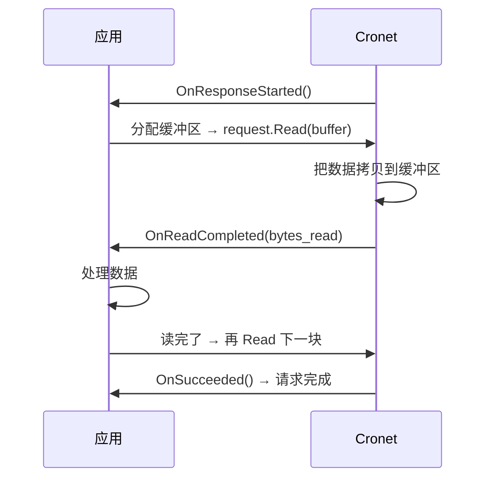

# Cronet 完整请求处理流程

这一章把所有模块串起来，看一个 HTTP 请求从 `Start()` 到结束完整走过的流程。

## 客户端调用入口

应用调用流程是这样的：

```java
// 1. 拿到全局 CronetEngine （APP启动时创建一次）
CronetEngine engine = CronetEngineBuilder.build();

// 2. 创建请求
UrlRequest request = engine.newUrlRequestBuilder(
    "https://example.com",
    callback,
    executor
).build();

// 3. 开始请求
request.start();
```

入口就是 `request.start()`，我们从这里进去看。

---

## 第一步：请求开始检查缓存

```
UrlRequest::Start()
    ↓
   检查请求是否合法
    ↓
   检查 HTTP 缓存:
        如果命中缓存，并且不需要验证:
            直接读缓存 → 回调 OnResponseStarted → 读 body → OnSucceeded → 结束
    ↓
        如果没命中，或者需要验证:
            继续走网络请求
    ↓
   状态变成 WAITING → 需要拿到连接才能继续
```

缓存这一步就可以结束请求，不用走网络，快很多。

---

## 第二步：DNS 解析

```
需要网络 → 检查 DNS 缓存:
    ↓
    如果命中 → 直接拿到 IP → 跳到下一步连接
    ↓
    如果没命中 → 触发异步 DNS 解析
         ↓
         系统 DNS 或者 DoH → 拿到 IP 地址列表
         ↓
         保存到 DNS 缓存 → 下次命中
    ↓
   解析失败 → 回调 OnFailed → 结束
```

Cronet 支持预解析：你预判用户要点这个链接，可以提前调用 `CronetEngine::Preconnect`，DNS 先解析好，请求的时候直接用。

---

## 第三步：获取连接

```
有了 IP → 从连接池找连接:
    ↓
    查找相同 host + port 有没有空闲空闲
    ↓
    如果有 → 直接复用 → 不用新建连接 → 跳到发送请求头
    ↓
    如果没有 → 新建连接
```

连接复用省了握手，是 Cronet 低延迟的关键。

---

## 第四步：建立连接 + TLS 握手

新建连接流程：

### TCP 连接：

```
新建 TCP socket → 三次握手连接到服务器
    ↓
    连接成功 → 开始 TLS 握手
    ↓
    TLS 1.3 握手 → 验证证书 → 导出密钥
    ↓
    握手成功 → 可以发送数据
```

### QUIC 连接：

```
新建 QUIC 会话 → 客户端发 Initial 包 + ClientHello
    ↓
    如果有会话缓存，可以 0-RTT → 直接发应用数据
    ↓
    握手完成 → 可以发送数据
```

失败了怎么办？尝试下一个 IP，直到成功或者全部失败。

---

## 第五步：发送请求头

```
组装 HTTP 请求头:
    方法(GET/POST) + path + HTTP版本
    ↓
    加上请求头 (Content-Type, Cookie, User-Agent 等)
    ↓
    如果是 HTTP/1.1 → 发出去
    如果是 HTTP/2 → 发 HEADERS 帧
    如果是 HTTP/3 → 发 HEADERS 帧到 QUIC 流
    ↓
    如果有 body → 接着发 body 数据
```

---

## 第六步：等待响应头

发送完请求头，Cronet 等服务器回响应：

```
服务器处理请求 → 发回响应头
    ↓
Cronet 收到响应头 → 解析
    ↓
   如果是重定向 (301/302/303/307/308):
        自动 follow 重定向 → 释放当前连接资源 → 从头开始新请求
    ↓
   如果是 200 正常响应:
        回调应用 OnResponseStarted() → 告诉应用响应头好了，可以开始读 body
        ↓
        进入读 body 状态
```

---

## 第七步：读取响应 body

应用读完一块，再读下一块：



关键点：
- 异步读，不要你阻塞等着
- 你给缓冲区，Cronet 填数据，用完你自己释放
- 流式读取，不用一下子把整个 body 都读到内存，省内存

---

## 第八步：请求完成释放资源

```
body 读完了 → 连接还活着 → 放回连接池 → 复用给下次请求
    ↓
回调应用 OnSucceeded()
    ↓
UrlRequest 生命周期结束 → 释放资源
```

如果请求失败了：

```
出错了 → 关闭连接（如果错在连接）→ 不放回池
    ↓
回调应用 OnFailed(error_code)
    ↓
释放资源
```

---

## 完整调用链总图

```mermaid
flowchart TD
    A[App调用 request.start()] --> B[检查HTTP缓存]
    B --> C{缓存命中?}
    C -->|是| D[直接返回缓存]
    D --> E[OnResponseStarted → OnReadCompleted → OnSucceeded]
    E --> Z[结束]
    C -->|否| F[DNS解析]
    F --> G{DNS缓存命中?}
    G -->|否| H[异步DNS解析]
    H -->|失败| AA[OnFailed → 结束]
    G -->|是| I[从连接池取连接]
    H -->|成功| I
    I --> J{找到空闲连接?}
    J -->|是| K[发送请求头]
    J -->|否| L[新建连接 TCP/QUIC]
    L --> M[TLS/QUIC握手]
    M -->|失败| AA
    M -->|成功| K
    K --> N[发送请求头和body]
    N --> O[等待响应头]
    O --> P{是重定向?}
    P -->|是| Q[释放资源 → 重定向到新URL]
    Q --> B
    P -->|否| R[OnResponseStarted]
    R --> S[App 分配缓冲 → Read]
    S --> T[Cronet填数据 → OnReadCompleted]
    T --> U{还有数据?}
    U -->|是| S
    U -->|否| V[OnSucceeded]
    V --> W[连接放回连接池]
    W --> Z[结束]
```

---

## HTTP/1.1 vs HTTP/2 vs HTTP/3 流程差异

| 阶段 | HTTP/1.1 | HTTP/2 | HTTP/3 |
|------|----------|--------|--------|
| 连接 | 每个连接一个请求并发要多个连接 | 一个连接多路复用多个请求 | 一个连接多路复用，UDP |
| 握手 | TCP + TLS 2-RTT | TCP + TLS 1-RTT → 至少 2-RTT | 0-RTT / 1-RTT |
| 队头阻塞 | 有，一个请求慢了阻塞后面 | 无应用层队头阻塞，TCP层还是有 | 完全无队头阻塞 |
| 连接迁移 | 不支持 | 不支持 | 支持，Wifi切移动不中断 |

Cronet 会自动协商，选最好的协议，不用你选。你只要打开 QUIC 开关就行。

---

## 连接池清理

连接池不会无限增长，空闲太久的连接会被关掉释放资源：

- 默认空闲 300 秒关闭
- LRU 淘汰，最多保留一定数量连接
- 当APP进入后台，Cronet 可以关闭空闲连接省内存

---

## 典型延迟 breakdown（手机 4G）

| 阶段 | 平均延迟 |
|------|----------|
| DNS 解析 | 20-100ms |
| TCP 三次握手 | 50-150ms |
| TLS 握手 (TLS 1.3) | 50-150ms |
| 请求发送 → 响应头回来 | 50-200ms |
| **总延迟（无缓存新建连接 HTTPS)** |  **200-600ms** |
| **总延迟（连接复用）** |  **50-200ms** |
| **总延迟（缓存命中）** |  **1-10ms** |

可见缓存和连接复用对延迟影响很大，Cronet 这两块优化得很好。

---

## 异步设计关键点

整个流程全异步：

- 没有任何地方阻塞主线程
- 所有 IO 都在 Cronet 内部 IO 线程做
- 结果回调扔给你指定的 Executor（可以是主线程）
- 你只要写好回调，不用管线程

---

上一章：[请求状态机](./04-request-statemachine.md)
下一章：[HTTP/3 QUIC 集成](./06-quic-integration.md)
