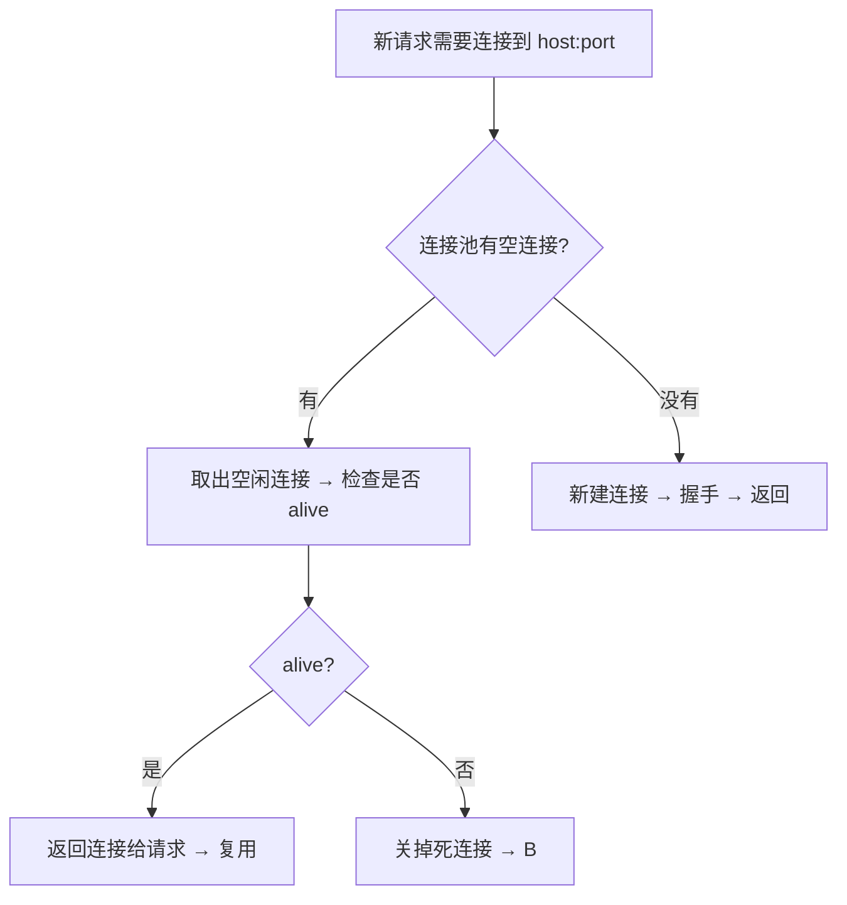

# Cronet 连接池和连接复用

连接复用是降低延迟最有效的手段，一次握手可以服务多个请求，Cronet 连接池做得非常成熟。

## 为什么要连接复用？

每次新建连接：
- TCP 三次握手 → 1 RTT
- TLS 握手 → 1-2 RTT
- QUIC 握手 → 0-1 RTT

加起来就是几百毫秒，如果能复用已有连接，直接省掉这几百毫秒，体验好太多。

## 连接池设计

```cpp
class ClientSocketPoolManager {
    // 按 group 分组，每个 group 对应 host:port
    std::map<GroupId, std::list<ClientSocket*> idle_sockets_;
    // 最大空闲连接数，默认 10 个每个域名
    int max_idle_sockets_;
    // 空闲超时，默认 300 秒
    int idle_timeout_secs_;
};
```

结构很简单：
- 相同 host:port 放一组
- 用完连接不是直接关掉，放回 idle 列表
- 下次新请求来了，先从 idle 列表拿一个用
- 空闲太久没人用，关掉释放资源

## 获取连接流程



## 淘汰策略

什么时候淘汰空闲连接：

1. **空闲超时** → 空闲超过 300 秒，关掉释放资源
2. **超过最大数量** → LRU 淘汰最久没用的那个
3. **APP 进入后台** → 关掉所有空闲连接，省内存省电量

## QUIC 会话池和 TCP 连接池区别

| TCP 连接池 | QUIC 会话池 |
|------------|-------------|
| 每个连接只能跑一个 HTTP/1.1 请求 | 一个会话可以跑N个请求多路复用 |
| 每个域名可以保留多个空闲连接 | 一个域名一般一个活跃会话足够 |
| 新建连接开销大 | 新建会话开销大，复用收益更大 |

所以 QUIC 会话池更简单，同一个域名一般就一个会话，一直复用，直到连接关闭。

## 连接复用对延迟影响

| 情况 | 新建连接延迟 | 复用连接延迟 |
|------|--------------|---------------|
| TCP TLS 1.2 | ~300-500ms | ~50ms |
| TCP TLS 1.3 | ~200-300ms | ~50ms |
| QUIC 0-RTT | ~100ms | ~30ms |

连接复用就是快，哪怕 QUIC 0-RTT 也不如复用已有连接快。

## 最佳实践

1. **不要随便关掉连接池** → 默认开着就好，收益很大
2. **允许足够的空闲连接数** → 每个域名 5-10 个足够
3 **空闲超时不要太短** → 300 秒比较合适，太短了经常新建连接
4. **后台清理空闲连接** → 省内存省电

---

上一章：[DNS 优化](./08-dns.md)
下一章：[集成指南和 API](./10-api-integration.md)
