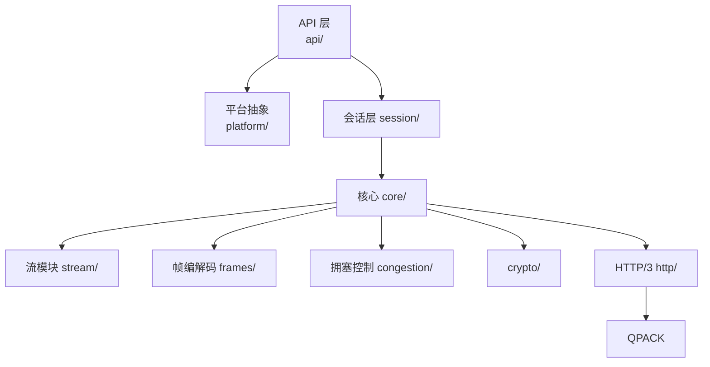

# Google QUICHE 功能模块划分

## 整体模块图



## 各模块职责详解

### 1. API 层 (`api/`)

**职责：**
- 定义对外的公共抽象接口
- 隔离实现细节，集成方只依赖 API 接口
- 方便替换实现，不影响上层

主要接口：
- `QuicSession` — 会话接口
- `QuicConnection` — 连接接口
- `QuicStream` — 流接口

---

### 2. 平台抽象 (`platform/`)

**职责：**
- 封装操作系统相关调用
- 内存分配、日志、时间、同步原语
- 让上层核心代码不依赖具体操作系统

**为什么要抽平台层？**
- Google QUICHE 要跑在 Chromium（Linux/macOS/Windows/Android/iOS）和 Envoy 等不同环境
- 抽成平台层后，每个环境只需要实现自己的平台接口就行
- 核心代码不用改

---

### 3. QUIC 核心 (`quic/core/`)

这是最核心的模块，包含连接级状态管理。

**职责：**
- `QuicConnection` — 整个 QUIC 连接的顶级对象
- 连接 ID 管理、连接迁移支持
- 版本协商
- 数据包处理入口
- 密钥更新
- 空闲超时处理
- 流量控制管理

---

### 4. 会话层 (`quic/session/`)

**职责：**
- 在 `QuicConnection` 之上，管理多个流的生命周期
- 处理加密握手
- 会话恢复（0-RTT）
- 流的创建和关闭
- 对外提供更高级接口

类层次：
```
QuicSession
  ├─> 维护所有流的映射
  ├─> 处理连接加密
  └─> 给上层提供创建流接口
```

---

### 5. 流处理模块 (`quic/stream/`)

**职责：**
- 单个 QUIC 流的状态管理
- 流数据的发送缓冲和接收缓冲
- 流的流量控制
- FIN 处理
- 流优先级

**主要类：**
- `QuicStream` — 基类
- `QuicSendStream` — 发送流
- `QuicReceiveStream` — 接收流

---

### 6. 帧编解码模块 (`quic/frames/`)

**职责：**
- 所有 QUIC 帧类型的序列化和反序列化
- 每个帧类型一个类
- 类型安全，不容易编解码错

支持所有标准帧：
- STREAM 帧
- ACK 帧
- CRYPTO 帧
- MAX_DATA / MAX_STREAM_DATA
- CONNECTION_CLOSE
- ... 等等

---

### 7. 拥塞控制模块 (`quic/congestion_control`)

**职责：**
- 各种拥塞控制算法实现
- 统一接口，方便切换

**已实现算法：**
- BBRv1
- BBRv2 （Google 推荐）
- Cubic
- Reno
- 几种探测算法

**设计：** 定义 `CongestionControlInterface`，新增算法只要实现这个接口。

---

### 8. 密码学和 TLS (`quic/crypto/`)

**职责：**
- 对接 BoringSSL 做 TLS 1.3 握手
- 密钥导出
- 数据包加密解密
- 证书验证
- 会话票证存储用于 0-RTT
- 地址验证（Cookie）

**设计：** 和 Cloudflare quiche 一样，密码学交给专业的 BoringSSL，QUICHE 只做对接。

---

### 9. HTTP/3 模块 (`quic/http/`)

**职责：**
- HTTP/3 语义映射到 QUIC 流
- HTTP 帧编解码
- QPACK 头压缩集成
- 服务端推送
- 连接设置传输

**主要类：**
- `Http3ClientSession`
- `Http3ServerSession`
- `Http3Stream`

---

### 10. QPACK 模块

**职责：**
- QPACK 编码器实现
- QPACK 解码器实现
- 动态表管理
- 阻塞处理

---

### 11. 工具模块 (`quic/tools`)

**职责：**
- 提供简单的 quic-client / quic-server 示例
- 测试工具
- 抓包工具
- 基准测试

---

## 模块依赖关系

严格单向依赖，没有环：

```
平台 ← 核心 ← 会话 ← 流 ← HTTP/3
      ↑
    拥塞控制
      ↑
    密码学
      ↑
    帧编解码
```

---

## 对比 Cloudflare quiche

Google QUICHE 因为来自 Chromium，整体代码量更大，功能更全：

| 功能 | Google QUICHE | Cloudflare quiche |
|------|---------------|-------------------|
| 连接迁移 | 完整实现 | 支持 |
| 多路径 | 正在完善 | 基础支持 |
| 拥塞控制算法 | 多种都完整实现 | 默认 BBRv2，可选 Cubic |
| 接口风格 | C++ 面向对象回调风格 | C API 简洁 |
| 代码体量 | 大，完整 | 小巧精干 |
| 生产环境经验 | 非常丰富（Chromium 亿级用户） | 丰富（Cloudflare 自己在用） |

---

上一章：[项目概览](./01-overview.md)
下一章：[核心数据结构](./03-data-structures.md)
