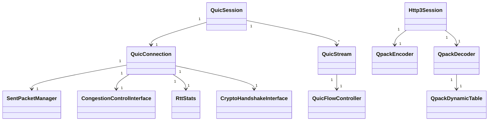

# Google QUICHE 核心数据结构

这一章梳理 Google QUICHE 最重要的几个顶层数据结构。

## 顶级连接对象: `QuicConnection`

```cpp
class QuicConnection {
    // 连接ID
    QuicConnectionId server_connection_id_;
    QuicConnectionId client_connection_id_;

    // 连接状态
    QuicConnectionState state_;

    // 版本
    ParsedQuicVersion version_;

    // 加密级别
    EncryptionLevel encryption_level_;

    // 已发送未确认数据包
    SentPacketManager sent_packet_manager_;

    // 流量控制
    QuicFlowController connection_flow_controller_;

    // 拥塞控制
    std::unique_ptr<CongestionControlInterface> congestion_control_;

    // RTT 测量
    RttStats rtt_stats_;

    // 丢包检测
    LostPacketDetector lost_packet_detector_;

    // 密码学接口
    CryptoHandshakeInterface* crypto_handshake_;

    // 对端地址
    QuicSocketAddress peer_address_;

    // 回调接口，给上层集成
    Delegate* delegate_;
};
```

**一句话**：`QuicConnection` 握有整个连接所有状态，处理数据包进出，协调所有模块工作。

---

## 会话层: `QuicSession`

`QuicSession` 在 `QuicConnection` 之上，管理流集合：

```cpp
class QuicSession {
private:
    QuicConnection* connection_;  // 持有底层连接

    // 所有活跃流，按 stream_id 映射
    std::map<QuicStreamId, std::unique_ptr<QuicStream>> streams_;

    // 控制流
    QuicStream* control_stream_;

    // HTTP/3 连接会有 QPACK 编解码流
    ...

    // 最大流数量限制
    QuicStreamCount max_open_outgoing_streams_;
    QuicStreamCount max_open_incoming_streams_;
};
```

职责：
- 流的创建、查找、销毁
- 握手完成后，应用层可以开始创建流了
- 分发从连接上来的数据给对应流

---

## 流对象: `QuicStream`

每个流对应一个 `QuicStream`：

```cpp
class QuicStream {
protected:
    QuicStreamId id_;
    QuicSession* session_;

    // 发送方向
    PendingDataBuffer send_buffer_;
    bool fin_sent_;

    // 接收方向
    ReceiveBuffer receive_buffer_;
    bool fin_received_;

    // 流量控制
    QuicFlowController flow_controller_;

    // 流状态
    bool is_closed_;
};
```

关键点：
- 发送缓冲区攒数据，连接打包的时候从各个流取数据拼成数据包
- 接收缓冲区放收到的乱序数据，拼好连续块给上层读
- 每个流自己有流量控制

---

## 已发送数据包管理: `SentPacketManager`

```cpp
class SentPacketManager {
    // 保存所有已发送未确认的数据包
    std::map<QuicPacketNumber, SentPacket> unacked_packets_;
    // 哪些数据包需要重传
    std::vector<QueuedPacket> retransmission_queue_;
};
```

什么时候用：
- 收到 ACK 后，查找哪些包被确认了
- 检测丢包后，把丢包加入重传队列
- 重传的时候从这里拿原始帧信息重打包

---

## 发送数据包结构: `SentPacket`

```cpp
struct SentPacket {
    QuicPacketNumber packet_number;
    TransmissionType transmission_type;
    QuicTime sent_time;
    size_t bytes_sent;
    bool in_flight;
    // 携带的所有帧信息，需要重传时用
    std::vector<SerializedFrame> frames;
};
```

---

## 流量控制: `QuicFlowController`

```cpp
class QuicFlowController {
private:
    // 我对端允许我发的最大偏移量
    QuicByteCount send_window_;
    // 我已经发了多少
    QuicByteCount bytes_sent_;
    // 对端发给我，我能接收的最大偏移量
    QuicByteCount receive_window_;
    // 已经接收了多少
    QuicByteCount bytes_received_;
};
```

每层（连接级和流级）都有一个 `QuicFlowController`。

---

## RTT 统计: `RttStats`

```cpp
class RttStats {
    // 最新一次采样 RTT
    QuicTime::Delta latest_rtt_;
    //  smoothed 移动平均 RTT
    QuicTime::Delta smoothed_rtt_;
    // RTT 方差
    QuicTime::Delta rtt_var_;
    // 最小 RTT 观察到
    QuicTime::Delta min_rtt_;
};
```

拥塞控制算法需要这个信息。

---

## 拥塞控制接口

```cpp
class CongestionControlInterface {
public:
    // 包被确认
    virtual void OnPacketAcked(QuicPacketNumber acked_packet_number,
                               QuicByteCount acked_bytes,
                               QuicTime ack_time);
    // 包丢失
    virtual void OnPacketLost(QuicPacketNumber lost_packet_number,
                              QuicByteCount lost_bytes,
                              QuicTime ack_time);
    // 包发送出去
    virtual void OnPacketSent(QuicTime sent_time,
                              QuicByteCount bytes_in_flight,
                              QuicByteCount packet_size);
    // 当前拥塞窗口多大
    virtual QuicByteCount GetCongestionWindow() const;
    // 是否可以发送
    virtual bool CanSend(QuicByteCount bytes_in_flight) const;
    // 获取 pacing 速率
    virtual QuicBandwidth PacingRate() const;
};
```

任何拥塞控制算法只要实现这个接口就能接入，设计清晰。

BBR 实现是 `Bbr2CongestionController`：

```cpp
class Bbr2CongestionController : public CongestionControlInterface {
private:
    Bbr2State state_;
    Bandwidth bandwidth_;
    Bbr2Params params_;
    ...
};
```

---

## HTTP/3 连接: `Http3Session`

```cpp
class Http3ClientSession : public QuicSession {
private:
    // QPACK 编码解码
    std::unique_ptr<QpackEncoder> qpack_encoder_;
    std::unique_ptr<QpackDecoder> qpack_decoder_;
    // 控制流
    std::unique_ptr<Http3ControlStream> control_stream_;
    // 请求流映射
    std::map<QuicStreamId, Http3Stream*> request_streams_;
};
```

职责：
- 把 HTTP/3 语义映射到 QUIC 流
- 调用 QPACK 做头压缩
- 把收到的头和数据交给客户端回调

---

## QPACK 动态表: `QpackDynamicTable`

```cpp
class QpackDynamicTable {
    vector<HeaderEntry> entries_;  // 动态表条目
    size_t inserted_count_;        // 总共插入了多少
    size_t capacity_;              // 动态表容量
};
```

编码器一端插入，解码器一端维护对端的动态表状态。

---

## 数据结构关系总图



---

## C++ 设计特点

1. **基类+虚函数**做接口抽象 → 方便替换不同实现
2. **基于回调** → 上层集成方实现 Delegate 接口处理事件
3. **内存管理** → 智能指针管理对象生命周期，不容易 leak
4. **const correctness** → 大量使用 const，代码更健壮

---

上一章：[功能模块划分](./02-modules.md)
下一章：[连接状态机](./04-connection-statemachine.md)
