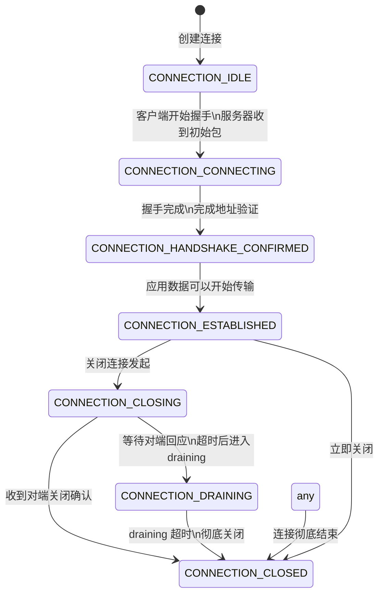
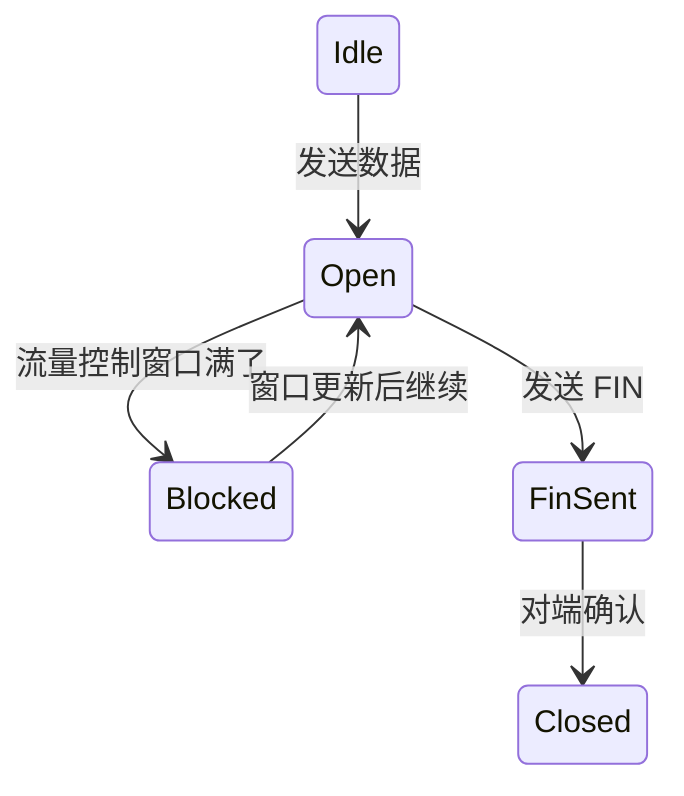
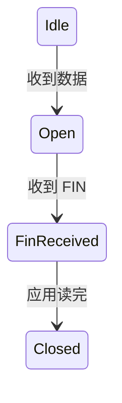

# Google QUICHE 连接状态机

QUICHE 连接状态机定义在 `QuicConnectionState` 枚举中，管理整个连接生命周期。

## 状态定义

```cpp
enum QuicConnectionState {
    CONNECTION_IDLE = 0,
    CONNECTION_CONNECTING = 1,
    CONNECTION_HANDSHAKE_CONFIRMED = 2,
    CONNECTION_ESTABLISHED = 3,
    CONNECTION_CLOSING = 4,
    CONNECTION_DRAINING = 5,
    CONNECTION_CLOSED = 6,
};
```

## 完整状态转移图



## 各个状态详解

### 1. CONNECTION_IDLE

**初始状态**：连接刚刚创建好，还没开始处理任何东西。

- 客户端：刚调用 connect，还没发送第一个包
- 服务器：刚 accept，还没处理客户端第一个包

转出条件：开始处理握手 → 进 `CONNECTION_CONNECTING`

---

### 2. CONNECTION_CONNECTING

握手正在进行中，还没完成。

做什么：
- 交换 Hello 消息
- 交换证书
- 导出密钥
- 验证 Finished

还不能发应用数据（除非 0-RTT early data）。

转出条件：
- 握手完成，地址验证通过 → `CONNECTION_HANDSHAKE_CONFIRMED`

---

### 3. CONNECTION_HANDSHAKE_CONFIRMED

握手已经完成，密钥已经导出，可以开始发应用数据了。

这个状态是 IETF QUIC 要求的，握手完成后先确认，再进入完全建立。

转出：
- 确认对端 Finished → `CONNECTION_ESTABLISHED`

---

### 4. CONNECTION_ESTABLISHED

完全建立，可以正常收发应用数据了。这是连接正常工作的状态。

这个状态下：
- 应用可以创建新流
- 收发数据
- 处理丢包重传
- 拥塞控制正常工作
- 连接迁移可以处理

保持多久：一直保持，直到关闭发起。

---

### 5. CONNECTION_CLOSING

本端或者对端发起关闭连接。

做什么：
- 发送 CONNECTION_CLOSE 帧
- 等待对端确认
- 还能处理对端发来的包

超时机制：
- 如果在超时时间内没收到对端回应 → 进 `DRAINING`

---

### 6. CONNECTION_DRAINING

正在排出数据，准备彻底关闭。

进入条件：
- CLOSING 超时没收到对端确认
- 或者收到对端发起关闭，我们回应后进入 DRAINING

做什么：
- 不发送任何新数据
- 只处理对端最后发来的数据
- 超时后彻底关闭

---

### 7. CONNECTION_CLOSED

连接彻底关闭，资源可以释放了。

---

## 流层面状态机

每个流也有自己的状态：

### 发送流状态



### 接收流状态



---

## 状态扭转触发方式

和 Cloudflare quiche 一样，Google QUICHE 也是**调用者驱动**：

1. **网络事件**：调用者收到数据包 → 调用 `ProcessUdpPacket` → 可能触发状态变化
2. **超时事件**：调用者定时器超时 → 调用 `OnTimeout` → 可能触发状态变化
3. **API 调用**：应用调用 `CloseConnection` → 直接触发状态变化

QUICHE 不自己设定时器，不自己读 socket，完全由调用者驱动。

---

## 错误处理路径

| 错误场景 | 状态跳转 |
|----------|----------|
| 握手失败 | `CONNECTING` → `CLOSING` → `CLOSED` |
| 协议错误 | 任意状态 → `CLOSING` / `DRAINING` → `CLOSED` |
| 空闲超时 | `ESTABLISHED` → `CLOSING` → `CLOSED` |
| 收到 CONNECTION_CLOSE | 当前状态 → `CLOSING` → `CLOSED` |

---

## 0-RTT 特殊情况

即使握手还在 `CONNECTING` 状态，如果 0-RTT 成功：
- 可以提前发送应用数据
- 不用等握手完成
- 节省一个 RTT

状态机还是 `CONNECTING`，但允许发送应用数据，这是特殊处理。

---

上一章：[核心数据结构](./03-data-structures.md)
下一章：[数据包处理完整流程](./05-packet-processing.md)
