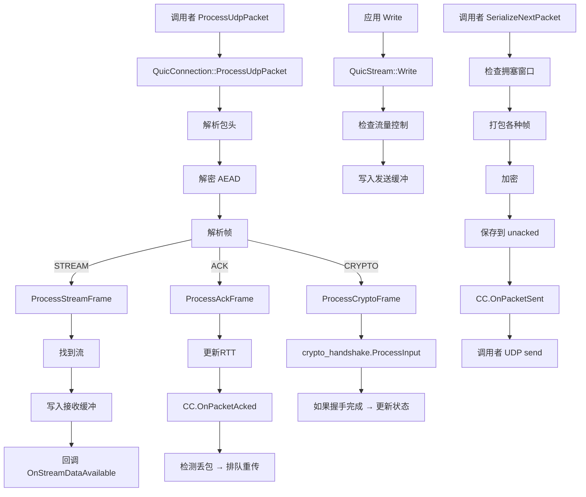

# Google QUICHE 数据包处理完整流程

这一章梳理从收到 UDP 数据包，一路到应用拿到数据的完整调用流程，以及应用发送数据到 UDP 发出的完整路径。

## 整体处理框架

Google QUICHE 基于**回调+事件驱动**设计：

```
调用者 (Envoy / Chromium)
    ↓
    收到 UDP 包 → 调用 QuicConnection::ProcessUdpPacket()
    ↓
QUICHE 处理完 → 调用 Delegate::OnConnectionClosed() / OnStreamDataAvailable() 回调
    ↓
调用者处理回调 → 把数据给应用
```

## 接收路径：从 UDP 到应用数据

### 第一步：调用者喂包

```cpp
// 调用者收到 UDP 数据，调用这个入口
connection->ProcessUdpPacket(self_address, peer_address, packet);
```

入口就在这里，所有进来的包都从这里进。

---

### 第二步：数据包解析

```
ProcessUdpPacket()
    ↓
   解析公有头 → 获取连接ID、包编号、标志位
    ↓
   根据连接ID找到连接（对于服务器）
    ↓
   判断加密等级 → Initial / Handshake / Application
    ↓
   获取对应解密密钥 → 解密数据包 → 验证 AEAD 标签
    ↓
   如果验证失败 → 丢包，直接返回错误
    ↓
   解密成功得到明文 payload → 开始逐帧解析
```

---

### 第三步：帧解析分发

```
循环解析帧：
    读帧类型 → 根据类型分发处理
```

不同帧类型进入不同处理函数：

| 帧类型 | 处理函数 |
|--------|----------|
| STREAM | `ProcessStreamFrame()` |
| ACK | `ProcessAckFrame()` |
| CRYPTO | `ProcessCryptoFrame()` |
| MAX_DATA / MAX_STREAM_DATA | `ProcessMaxDataFrame()` / `ProcessMaxStreamDataFrame()` |
| CONNECTION_CLOSE | `ProcessConnectionClose()` |
| NEW_CONNECTION_ID | `ProcessNewConnectionId()` |

---

### 第四步：STREAM 帧处理（应用数据）

```
ProcessStreamFrame()
    ↓
   根据 stream_id 找到流 → 不存在就新建流
    ↓
   检查流量控制 → 是否超过接收窗口
    ↓
   如果超过 → 关闭连接，错误码 FLOW_CONTROL_ERROR
    ↓
   把数据写入流的接收缓冲区
    ↓
   如果数据拼接后有新的连续数据可读 →
        标记流可读 →
        回调 Delegate::OnStreamDataAvailable()
    ↓
   如果需要更新流量控制窗口 → 排队 MAX_DATA 帧待发送
```

**关键点**：收到数据马上通过回调通知调用者，调用者可以立刻来读。

---

### 第五步：ACK 帧处理

```
ProcessAckFrame()
    ↓
   遍历所有被 ACK 的包编号
    ↓
   从 sent_packets 找到对应的包 → 标记为已确认
    ↓
   计算 RTT → 更新 rtt_stats
    ↓
   调用拥塞控制->OnPacketAcked() → 更新拥塞窗口、带宽估计
    ↓
   检测丢包 → 哪些包超过时间还没被ACK → 认为丢失
    ↓
   对于每个丢失的包 →
        调用拥塞控制->OnPacketLost() →
        把包加入重传队列
```

---

### 第六步：CRYPTO 帧处理（握手数据）

```
ProcessCryptoFrame()
    ↓
   按偏移把数据拼接到 crypto 接收缓冲区
    ↓
   完整数据传给 crypto_handshake_->ProcessInput()
    ↓
   Crypto 层（BoringSSL）处理握手 → 如果有输出 →
        要发送的握手数据放到 crypto 发送队列
    ↓
   如果握手完成 → 更新连接状态机 → 进入 ESTABLISHED
    ↓
   回调 Delegate->OnHandshakeComplete()
```

---

### 第七步：调用者读数据

QUICHE 通过回调告诉你哪个流有数据了，你调用：

```cpp
stream->Readv(iovec, iovcnt);
```

把数据读到你自己的缓冲区，处理业务逻辑。

---

## 发送路径：从应用写出到 UDP 发出

### 第一步：应用写数据

```cpp
stream->Write(data, len, fin);
```

做什么：
1. 检查流量控制窗口够不够
2. 不够返回错误，告诉你发不动
3. 够就把数据拷贝到流的发送缓冲区
4. 标记流有数据待发送
5. 如果 fin = true，标记发送结束

---

### 第二步：打包发送

调用者在合适的时机（比如 Epoll 可写）调用：

```cpp
connection->SendPackets();
```

或者自己批量打包：

```cpp
while (connection->CanWrite()) {
    // 打包一个数据包
    SerializedPacket packet = connection->SerializeNextPacket(...);
    // 调用者把 packet 通过 UDP 发出去
    sendto(fd, packet.data, packet.len, ...);
}
```

打包过程：

```
SerializeNextPacket()
    ↓
   检查拥塞窗口: in_flight >= cwnd → 不能发了，返回
    ↓
   分配包编号
    ↓
   填充包头
    ↓
   按优先级添加帧:
        1. ACK 帧优先 → 必须及时确认
        2. CRYPTO 帧 → 握手数据优先
        3. 重传帧 → 先重传丢包
        4. 新数据 → 从各个流取
    ↓
   直到装不下下一个帧 → 停止打包
    ↓
   加密数据包 → 添加 AEAD 标签
    ↓
   把包加入 unacked_packets → 等待 ACK
    ↓
   调用拥塞控制->OnPacketSent() → 更新状态
    ↓
   返回给调用者 → 调用者 UDP 发送
```

**多路复用怎么体现？**：一个 QUIC 数据包可以塞多个流的帧，所以多个流在一个 UDP 连接里并发跑，互不影响。

---

## 完整例子：一次 HTTP/3 GET 请求

### 客户端流程

```
1. 客户端创建连接 → 状态 CONNECTING
2. 客户端发送 Initial 包带 ClientHello
3. 客户端 0-RTT 就绪 → 提前创建流 → 写 HTTP GET 请求头和 body
4. 打包发送 → 调用者 UDP 发给服务器
```

### 服务器流程

```
1. 服务器收到 Initial 包 → ProcessUdpPacket → 新建连接
2. 解析 ClientHello → 交给 Crypto 层处理 → 生成 ServerHello 证书
3. 打包 ServerHello → 发送回去
4. 如果 0-RTP 被接受 → 提前处理客户端早期数据 → 解析 HTTP GET
5. 处理请求 → 生成响应 → 写响应头和 body → 发送给客户端
6. 握手完成 → 连接进入 ESTABLISHED
```

### 完整往返

```
客户端 → [Initial + ClientHello + 0-RTT HTTP GET] → 服务器
客户端 ← [ServerHello + Certificate + HTTP response] ← 服务器
客户端收到响应 → 握手完成 → 连接 ESTABLISHED → 应用处理响应
```

---

## 超时处理路径

调用者定时器到点了，调用：

```cpp
connection->OnTimeout();
```

QUICHE 做：

```
OnTimeout()
    ↓
   检查 idle_timeout → 如果太久没有收到任何包 → 关闭连接
    ↓
   检查 PTO 超时 → 哪些包应该被确认还没确认 → 标记丢包
    ↓
   标记丢包加入重传队列 → 调用拥塞控制 OnPacketLost
    ↓
   如果需要发送探测包 → 安排发送
    ↓
   如果连接需要关闭 → 改变状态机 → 发 CONNECTION_CLOSE
```

---

## 功能模块调用关系总图



---

## 设计特点总结

### 1. 回调驱动，不碰 IO

整个 QUICHE 不绑定任何事件循环（epoll / IOCP  whatever），你只要：
- 收到包喂进来
- 超时了调用 OnTimeout
- QUICHE 处理完调用你的回调，告诉你发生什么事
- 你发出去打包好的包

非常容易集成到任何现有架构。

### 2. 批量打包提高效率

quiche 会尽量把多个流的数据塞到一个 UDP 包，减少包头开销，提高传输效率。

### 3. 优先级明确

ACK > Crypto > 重传 > 新数据，这个优先级保证握手和延迟敏感的包先走。

### 4. 零拷贝？

QUICHE 需要把数据从应用缓冲区拷贝到流发送缓冲区，最终打包到输出数据包。这是 C++ 实现常见设计，比完全零拷贝好实现，性能也足够。

---

上一章：[连接状态机](./04-connection-statemachine.md)
下一章：[拥塞控制实现](./06-congestion-control.md)
