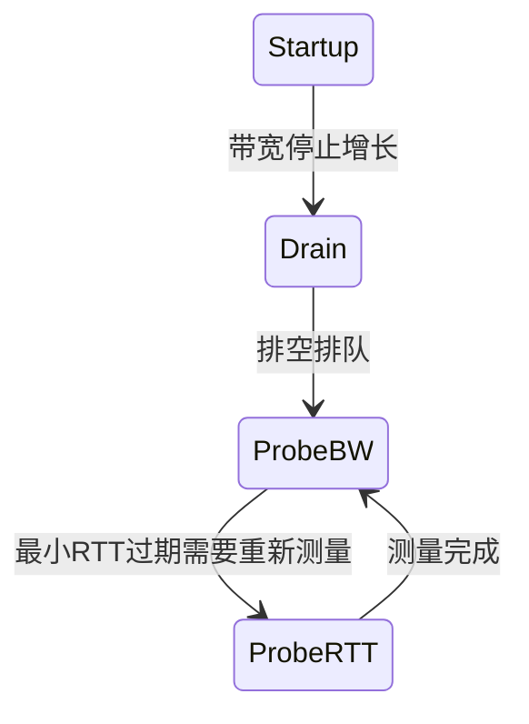

# Google QUICHE 拥塞控制实现

Google QUICHE 拥塞控制模块设计得非常好，接口清晰，支持多种算法切换。

## 整体架构

```
CongestionControlInterface 抽象接口
    ├─> Bbr2CongestionController  (默认推荐)
    ├─> Bbr1CongestionController
    ├─> CubicCongestionController
    ├─> RenoCongestionController
    └─> 其他实验性算法
```

所有算法都实现同一个接口，运行时可以切换。

## 接口定义

核心方法：

```cpp
class CongestionControlInterface {
    // 包已经被对端ACK确认
    virtual void OnPacketAcked(
        QuicPacketNumber acked_packet_number,
        QuicByteCount acked_bytes,
        QuicTime ack_time) = 0;

    // 包已经被判定丢失
    virtual void OnPacketLost(
        QuicPacketNumber lost_packet_number,
        QuicByteCount lost_bytes,
        QuicTime ack_time) = 0;

    // 包已经发送出去
    virtual void OnPacketSent(
        QuicTime sent_time,
        QuicByteCount bytes_in_flight,
        QuicByteCount packet_size) = 0;

    // 当前拥塞窗口多大
    virtual QuicByteCount GetCongestionWindow() const = 0;

    // 当前能否发送数据
    virtual bool CanSend(QuicByteCount bytes_in_flight) const = 0;

    // 当前 pacing 发送速率
    virtual QuicBandwidth PacingRate() const = 0;

    // 是否处于恢复阶段
    virtual bool InRecovery() const = 0;
};
```

设计简洁清晰，每个方法职责单一。

---

## BBRv2 默认实现

Google QUICHE 默认用 BBRv2，这是目前 Google 推荐的生产环境算法。

### BBRv2 状态机



和 Cloudflare quiche 实现的是同一个 BBRv2，思路完全一样。

### 核心参数

```cpp
struct Bbr2Params {
    // 初始拥塞窗口，单位 packets
    QuicByteCount initial_cwnd = 10;
    // 最小拥塞窗口
    QuicByteCount min_cwnd = 4;
    // 多长时间探测一次最小RTT
    QuicTime::Delta probe_rtt_interval = QuicTime::Delta::FromSeconds(10);
    // Startup 增益系数
    double startup_gain = 2.89;
    // ......
};
```

都是 BBR 标准推荐值。

### BBRv2 在 QUICHE 中的创新点

- 配合 QUIC 的 ACK 机制，更精确的带宽采样
- 对多流公平性比 BBRv1 好很多
- 在无线网络丢包下更稳定

---

## Cubic 实现

Cubic 是 TCP 现在默认用的基于丢包的拥塞控制算法，QUICHE 也完整实现了。

### 核心思想

- 窗口增长遵循三次曲线：`cwnd = C(t-K)^3 + cwnd_max`
- 丢包之后窗口降到 `cwnd * beta`
- 然后慢慢恢复

适合和传统 TCP 流公平竞争带宽。

---

## 发送控制逻辑

连接层面怎么用拥塞控制：

```cpp
bool QuicConnection::CanWrite(QuicByteCount bytes_in_flight) {
    // 问拥塞控制现在能不能发
    return congestion_control_->CanSend(bytes_in_flight);
}

void QuicConnection::OnPacketSent(...) {
    // 告诉拥塞控制我发了一个包
    congestion_control_->OnPacketSent(...);
}

void QuicConnection::OnAck(...){
    // ACK 了一个包，告诉拥塞控制
    congestion_control_->OnPacketAcked(...);
}

void QuicConnection::OnLost(...){
    // 丢了一个包，告诉拥塞控制
    congestion_control_->OnPacketLost(...);
}
```

分层非常清晰，连接层面只负责调用，算法逻辑全在拥塞控制模块。

---

## Pacing 发送

所有算法都支持 pacing：

```cpp
QuicBandwidth rate = congestion_control_->PacingRate();
```

pacing 就是把要发送的数据均匀分布在时间上，不要一下子突发都发出去，减少路由器排队丢包。

BBR 默认开 pacing，发挥最好效果。

---

## 带宽采样

QUICHE 在 ACK 处理的时候做带宽采样：

```
每个被ACK的包，我们知道它什么时候发的，什么时候被ACK → 得到这个包的传输速率
更新最大带宽采样 → BBR 用最大带宽作为瓶颈带宽估计
```

采样结果存在 `bandwidth_sampler_` 里，给拥塞控制用。

---

## RTT 统计

```cpp
class RttStats {
    QuicTime::Delta latest_rtt();    // 最近一次RTT
    QuicTime::Delta smoothed_rtt();  // 平滑后的RTT
    QuicTime::Delta min_rtt();       // 观察到的最小RTT
};
```

BBR 需要最小 RTT 计算 BDP，所以一直维护着。

---

## 怎么切换算法

编译时或者运行时都可以切换：

```cpp
// 创建连接的时候指定算法
config->set_congestion_control_type(BBR2);
// or
config->set_congestion_control_type(CUBIC);
```

QUICHE 根据类型创建对应的控制器，多态调用，上层完全不用改代码。

---

## 丢包检测配合拥塞控制

丢包检测在 `LostPacketDetector`：

```
收到 ACK → 检查哪些包在最近被ACK的包之前，还没被ACK → 认为丢失
每个丢失包 → 调用 CC.OnPacketLost() → CC 调整窗口
```

所以：
- `LostPacketDetector` → 判断谁丢了
- `CongestionController` → 根据丢包调整发送速率

分工明确。

---

## 性能优化点

1. **Early 重传** → 不用等超时，根据 SACK 信息尽早检测丢包
2. **启发式丢包检测** → 减少虚假重传
3. **Pacing 均匀发送** → 减少突发丢包
4. **带宽采样优化** → 更准确得到瓶颈带宽

---

## 各算法适用场景

| 算法 | 适用场景 |
|------|----------|
| BBRv2 | 默认推荐，现代互联网，长肥管道，吞吐量优先 |
| Cubic | 需要和 TCP 公平争带宽，兼容传统网络 |
| BBRv1 | 旧版本，兼容性保留，一般不用了 |
| Reno | 非常保守，适合窄带链路 |

Google 自己的服务大规模用 BBRv2，效果很好。

---

上一章：[数据包处理流程](./05-packet-processing.md)
下一章：[TLS 1.3 握手集成](./07-tls-integration.md)
