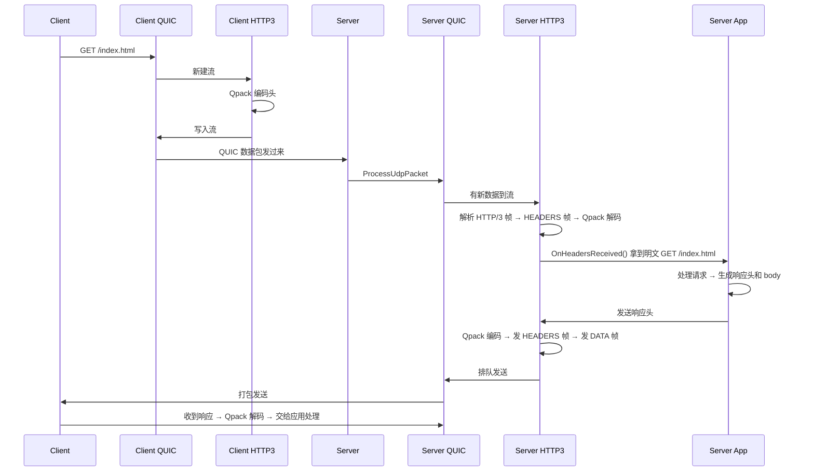

# Google QUICHE HTTP/3 和 QPACK 实现

QUIC 是传输层，HTTP/3 是应用层协议，跑在 QUIC 上面。这一章讲解 QUICHE 中 HTTP/3 和 QPACK 的实现。

## HTTP/3 模型

HTTP/3 把每个 HTTP 请求/响应映射到一个 QUIC 双向流：

```
QUIC 连接
├─> 控制流 (服务器单向流)
├─> QPACK 编码器流 (客户端单向流)
├─> QPACK 解码器流 (服务器单向流)
├─> 请求 1 → 双向流 ID 0
├─> 请求 2 → 双向流 ID 2
└─> ...
```

- 每个请求完全独立，不队头阻塞
- 多个请求可以并发在同一个 QUIC 连接上
- 连接可以复用，不用每个请求新建连接

## QUICHE HTTP/3 类层次

```cpp
// 顶级 HTTP/3 会话
class Http3Session : public QuicSession {
    // QPACK 编码解码器
    std::unique_ptr<QpackEncoder> qpack_encoder_;
    std::unique_ptr<QpackDecoder> qpack_decoder_;
    // 控制流
    std::unique_ptr<Http3ControlStream> control_stream_;
};

// 单个 HTTP/3 流（对应一个请求/响应）
class Http3Stream : public QuicStream {
    // 解析 HTTP/3 帧
    Http3Decoder decoder_;
    // 状态
    Http3StreamState state_;
    // 头缓冲区
    std::vector<Header> headers_;
};
```

---

## HTTP/3 帧处理

HTTP/3 定义了几种帧类型：

| 帧类型 | 用途 |
|--------|------|
| HEADERS | 传输 HTTP 头（压缩后） |
| DATA | 传输 HTTP body |
| PUSH_PROMISE | 服务器推送 |
| GOAWAY | 优雅关闭连接 |
| SETTINGS | 连接设置 |

QUICHE 处理流程：

```
从 QUIC 流收到数据 → Http3Decoder 逐字节解析帧
    ↓
如果是 HEADERS 帧 →
    取出压缩后的头块 → QpackDecoder 解码 → 得到明文头 → 回调通知应用
    ↓
如果是 DATA 帧 →
    把数据放到缓冲区 → 回调通知应用有数据可读
    ↓
如果是 SETTINGS → 解析设置，更新本地状态
```

---

## QPACK 头压缩

QPACK = **QPACK 就是 HTTP/3 专用的头压缩**，替代 HTTP/2 的 HPACK。

QPACK 解决了 HPACK 在多路复用下的队头阻塞问题。

### QPACK 核心思想

- 静态表：放最常见的头（:method, :scheme, accept, 等等），提前约定，不用传
- 动态表：两边维护，最近发过的头可以存在表里，下次只发索引发，不发全名
- 编码器发增量更新，解码器维护和编码器一致的动态表状态

### QPACK 在 QUICHE 中的结构

```cpp
// 编码器（我发给你头，我编码）
class QpackEncoder {
    const StaticTable* static_table_;
    DynamicTable dynamic_table_;
    // 编码器流：发动态表更新给对方
    QpackEncoderStream encoder_stream_;
};

// 解码器（你发给我头，我解码）
class QpackDecoder {
    DynamicTable dynamic_table_;
    // 解码器流：接收动态表更新
    QpackDecoderStream decoder_stream_;
    // 解码头块
    QpackHeaderBlockDecoder decoder_;
};
```

### 为什么要单独的编码器流和解码器流？

因为：
- 如果动态表更新跟着头块走，头块乱序会导致解码器阻塞
- 单独流发送动态表更新，保证动态表更新按顺序到达，不会阻塞解码

这就是 QPACK 解决 HTTP/2 HPACK 队头阻塞的方案。

---

### QPACK 编码流程（发送头）

```
应用给你明文 HTTP 头 →
    ↓
QPACK 编码器：
    匹配静态表 → 如果完全命中 → 只发索引
    匹配动态表 → 如果命中 → 发索引
    不命中 → 发字面量，同时加入动态表 → 发动态表更新到编码器流
    ↓
编码完成 → 得到压缩头块 → 放到 HEADERS 帧 → 通过 QUIC 流发送
    ↓
动态表更新通过 QPACK 编码器流发给对端
```

---

### QPACK 解码流程（接收头）

```
收到压缩头块 →
    ↓
QPACK 解码器：
    逐个解析字段 →
    如果是静态表索引 → 直接查表得头
    如果是动态表索引 → 从动态表得头
    如果是字面量 → 解码字面量，加入动态表
    ↓
得到完整明文 HTTP 头列表 → 交给 HTTP/3 层 → 回调应用
```

---

## 完整 HTTP 请求处理（服务器端）



---

## 服务器推送 (Push)

HTTP/2 就有推送，HTTP/3 也支持：

- 服务器知道客户端需要这个资源，主动推给客户端
- 提前推好了，客户端不用再请求，省 RTT
- QUICHE 中：服务器新建推送流 → 把资源数据发过去 → 客户端缓存

---

## GOAWAY 优雅关闭

服务器想要干净关闭连接，发 GOAWAY 帧：

- GOAWAY 告诉客户端：不要再开新流了，我要关了
- 已经开的流继续处理完
- 所有流处理完 → 关闭连接
- 对用户无感知，优雅关闭

---

## API 调用流程（客户端）

1. 创建 `Http3ClientSession`
2. 等到握手完成 → `OnHandshakeComplete()` 回调
3. 调用 `CreateOutgoingStream()` 创建新流
4. 编码请求头 → `qpack_encoder->Encode()` → 写入流
5. 写入 body 数据 → 发 FIN
6. 服务器响应回来 → 回调 `OnHeadersReceived()` / `OnDataReceived()`
7. 读完响应 → 流关闭

---

## 设计亮点

1. **QPACK 动态表完全正确实现** → 支持阻塞处理，动态更新，符合 IETF 标准
2. **每个请求一个流** → 完全映射 HTTP 语义，好理解
3. **依赖 QUIC 流可靠性** → HTTP/3 不用自己做重传排序，QUIC 都做了
4. **回调驱动** → 集成方只需要实现几个回调就能用

---

## 和 HTTP/2 对比

| 特性 | HTTP/2 over TCP | HTTP/3 over QUIC |
|------|-----------------|------------------|
| 多路复用 | 有 | 有 |
| 队头阻塞 | 存在（TCP 层） | 不存在（每个流独立ACK） |
| 头压缩 | HPACK | QPACK |
| 端口 | 443 TCP | 443 UDP |
| 连接迁移 | 不支持 | 支持 |
| 握手延迟 | 至少 2-RTT | 1-RTT 或 0-RTT |

---

上一章：[TLS 集成](./07-tls-integration.md)
下一章：[功能完整调用链](./09-integration-flow.md)
