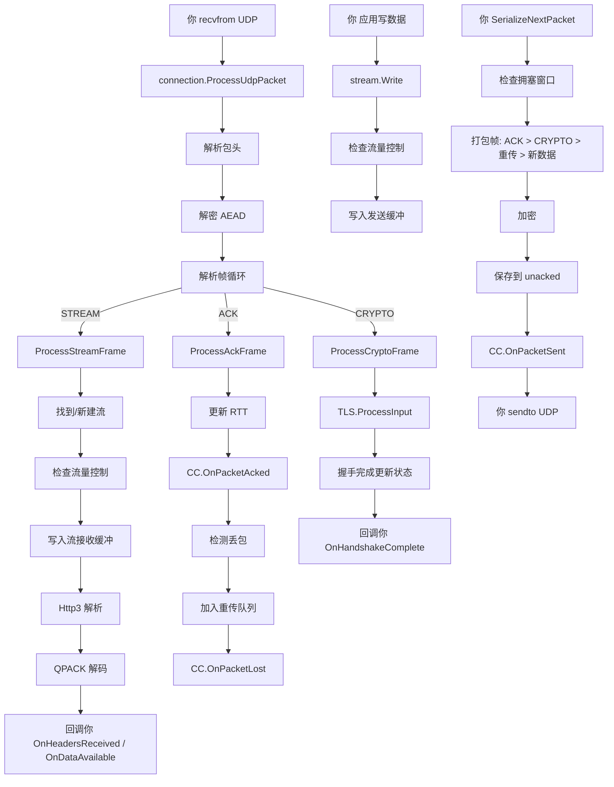

# Google QUICHE 完整功能调用链

前面分模块讲了各个部分，现在把所有模块串起来，看一个完整请求处理从头到尾怎么走。

## 总体架构回顾

QUICHE 是**回调驱动**的库：

- 你（集成方）负责 UDP IO 和定时器
- QUICHE 负责协议处理，有事件了调用你的回调
- 你在回调里处理业务，再调用 QUICHE API 发送数据

## 完整案例：客户端 GET 请求处理

### 阶段一：连接建立

```
你:
  1. 创建 QuicConfig 配置
  2. 创建 CryptoConfig
  3. 调用 QuicClientConnection::Create() 创建连接
  4. 连接调用你的 Delegate::GetClientSockAddr() 得到地址
  ↓
QUICHE:
  1. 初始化 QuicConnection，状态变成 CONNECTING
  2. 初始化 TLS 握手
  3. 生成第一个 ClientHello 放进 CRYPTO 帧
  4. 打包成 Initial 数据包
  ↓
你:
  1. 拿到要发送的数据包
  2. sendto UDP socket 发给服务器
```

### 阶段二：服务器回应

```
你:
  1. recvfrom 收到服务器回应数据包
  2. 调用 connection->ProcessUdpPacket(src, dst, buf)
  ↓
QUICHE:
  1. 解析包头 → 判断加密等级 → 解密
  2. 解析出帧：ServerHello 证书都在 CRYPTO 帧
  3. ProcessCryptoFrame → 喂给 TLS
  4. TLS 验证证书 → 生成密钥 → 导出密钥给连接
  5. 客户端发 Finished → 排队要发送
  6. 握手完成 → 连接状态变成 ESTABLISHED
  7. 调用你的 Delegate->OnHandshakeComplete()
  ↓
你:
  握手完成，可以发请求了
```

### 阶段三：发送 HTTP 请求

```
你:
  1. http3_session->CreateOutgoingStream() → 新建流
  2. 准备请求头：:method GET, :scheme https, :authority example.com, :path /
  3. qpack_encoder->Encode(headers, &encoded_buffer)
  4. stream->WriteHeaders(encoded_buffer)
  5. 如果有 body，stream->WriteBody(data, fin=true)
  ↓
QUICHE:
  1. HEADERS 帧封装 → 放到流发送缓冲区
  2. 标记流有数据待发送
  ↓
你:
  调用 connection->CanWrite() → 可以发送
  while (connection->CanWrite()) {
      packet = connection->SerializeNextPacket()
      sendto(sock, packet.data(), packet.len(), ...)
  }
  ↓
QUICHE:
  打包的时候：
  1. 先放 ACK 帧（如果需要ACK）
  2. 再放 CRYPTO 帧（如果还有握手数据）
  3. 再放重传
  4. 再放新数据 → 取出我们请求的 HEADERS 帧和 DATA 帧 → 装进数据包
  5. 加密 → 保存到 unacked_packets → 告诉拥塞控制包发了
  ↓
你:
  数据包发去服务器
```

### 阶段四：服务器处理请求发回响应

```
服务器这边和上面差不多：
  收到你的请求包 → ProcessUdpPacket → 解析出 STREAM 帧 → 找到流 → 交给 HTTP/3 → QPACK 解码 → 得到请求头 → 回调服务器应用 → 应用生成响应 → 编码头 → 写 body → 打包发送
  ↓
响应数据包发回客户端
```

### 阶段五：客户端收到响应

```
你:
  recvfrom 拿到响应包 → connection->ProcessUdpPacket()
  ↓
QUICHE:
  解密 → 解析帧 → STREAM 帧 → 找到对应的请求流 → 写入接收缓冲区
  ↓
  HTTP/3 解析 → HEADERS 帧 → QPACK 解码 → 得到响应头
  ↓
  回调你的 Delegate->OnHeadersReceived()
  ↓
  然后 DATA 帧 → 放到接收缓冲区 → 回调 OnDataAvailable()
  ↓
你:
  在 OnDataAvailable() 里调用 stream->Read(buffer, len) → 把响应数据读出来 → 处理（渲染/保存/ whatever）
  ↓
  读完 fin → 请求完成
```

整个流程结束，连接可以保持开着，下一个请求继续用，不用重新握手。

---

## 丢包重传完整流程

如果丢包了，整个链条怎么走：

```
客户端发了包 #100 没到服务器
  ↓
服务器收到 #101 → 回 ACK 的时候，会显示承认到 #99，#100 缺了
  ↓
客户端收到 ACK → 处理 ACK 帧 → 看到 #100 没被确认，在 #101 之前 → 检测到丢包
  ↓
Recovery 模块标记 #100 丢失 → 把 #100 里的所有帧加入重传队列
  ↓
拥塞控制 OnPacketLost(#100) → 拥塞窗口调整
  ↓
下一次 connection->Send() → 打包的时候，重传帧优先打包 → 把丢的帧重发
  ↓
服务器收到重传 → 处理，继续走流程
```

---

## 超时处理完整流程

```
你的定时器到点了 → 调用 connection->OnTimeout(now)
  ↓
QUICHE:
  1. 检查 idle_timeout: 如果从上次收到包到现在超过 idle_timeout → 关闭连接
  ↓
  2. 检查 PTO 超时: 如果有未确认的包超过 PTO 时间还没 ACK →
      标记这些包丢失 → 加入重传队列 → 拥塞控制处理
      ↓
      如果没包发也要发一个探测包 → 排队探测包
  ↓
  3. 如果需要关闭 → 改变状态 → 发 CONNECTION_CLOSE
  ↓
你:
  下次 send 把 CONNECTION_CLOSE 发出去
```

---

## 模块调用全景图



---

## 设计哲学总结

### 1. 责任分离非常清楚

- **你**：UDP 读写，定时器，业务逻辑
- **QUICHE**：协议编解码，状态机，拥塞控制，流量控制，加密
- **BoringSSL**：TLS 握手，密码学计算

没有谁越权干别人的活，好维护好集成。

### 2. 面向对象，多态接口

- 拥塞控制接口 → 想换算法就换算法
- 加密接口 → 想换加密实现就换
- Delegate 回调 → 你只要实现几个回调就集成好了

### 3. 久经战场考验

- Google Chromium 亿级用户用了好多年
- Envoy 服务端广泛用
- 从 IETF 早期版本一直跟进到最新 RFC，标准跟进非常快
- bug 修得快，安全更新及时

---

## 集成要点容易踩坑

1. **定时器必须按时调用 OnTimeout** → 不调用丢包检测不工作，连接死了
2. **收到包必须立刻喂给 ProcessUdpPacket** → 延迟会导致 RTT 测量不准，影响拥塞控制
3. **打包完必须立刻发送** → 延迟会增加延迟，影响性能
4. **必须处理 WouldBlock** → 窗口满了就别发了，等 ACK 来了再发
5. **连接用完记得释放资源** → 虽然 C++ 智能指针会帮你，但计时器记得取消

---

上一章：[HTTP/3 和 QPACK](./08-http3-qpack.md)
下一章：[公共 API 与集成](./10-public-api.md)
