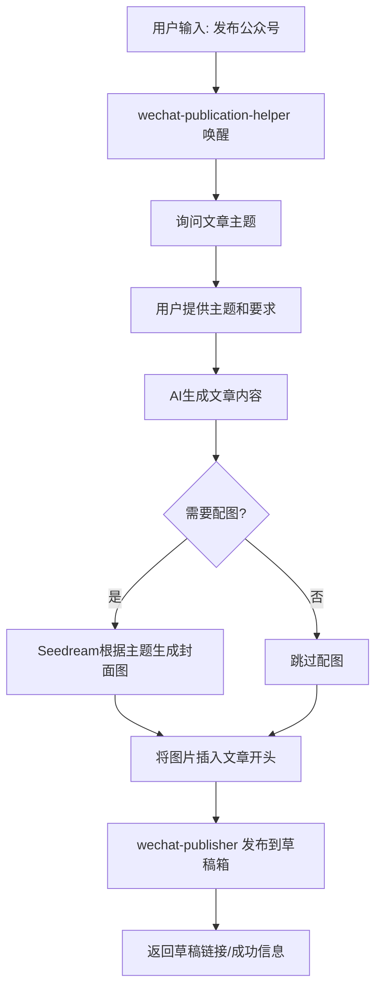

# OpenClaw 微信公众号文章发布流程

本文总结了在OpenClaw中生成并发布微信公众号文章的完整流程，涉及的相关skill和操作步骤。

## 概述

OpenClaw通过组合多个skill，可以实现从**主题输入 → AI生成文章 → AI生成配图 → 一键发布到公众号草稿箱**的完整自动化流程。

## 涉及的Skill

| Skill名称 | 作用 | 状态 |
|-----------|------|------|
| `wechat-publication-helper` | 文章发布助手，唤醒关键词"发布公众号"，引导输入主题，自动调用生成 | ✅ 可用 |
| `wechat-publisher` | 一键发布Markdown到微信公众号草稿箱，基于wenyan-cli | ✅ 已配置 |
| `seedream-image-for-openclaw` | 火山引擎Seedream生成配图 | ✅ 已配置 |
| `wemp-operator` | 微信公众号自动化运营（采集热点、生成日报等） | ⚠️ 安装中 |

## 完整发布流程



## 详细步骤说明

### 1. 触发流程

**用户输入关键词：**
```
发布公众号
```

`wechat-publication-helper` 技能被触发，开始引导流程。

### 2. 获取文章信息

- Skill询问用户：**文章主题是什么？有什么具体要求？**
- 用户提供主题，例如：`"总结OpenClaw微信公众号发布流程，要求详细，配流程图"`
- 可选要求：配图、字数要求、风格要求等

### 3. 生成文章内容

- AI根据主题和要求生成完整文章内容
- 使用Markdown格式
- 如果需要流程图，使用Mermaid语法
- 代码块自动适配solarized-light高亮主题

### 4. 生成配图（可选）

- 如果用户要求配图或明确需要封面图
- 调用 `seedream-image-for-openclaw` 根据文章主题生成配图
- 图片保存后插入到文章开头
- 默认命名 `cover.png`

### 5. 发布到公众号草稿箱

`wechat-publisher` 完成以下操作：

1. 将Markdown转换为微信公众号兼容的HTML格式
2. 自动上传所有图片到微信素材库
3. 创建草稿并保存到公众号草稿箱
4. 返回成功信息和草稿链接

### 6. 人工确认

- 用户打开微信公众平台
- 在草稿箱找到生成的文章
- 预览、微调、然后群发

## 目录结构示例

```
wechat-articles/
├── 2026-04-01-openclaw-introduction/
│   ├── index.md
│   └── cover.png
├── 2026-04-05-ai-cookbook-intro/
│   ├── index.md
│   └── cover.png
└── README.md
```

## 技能配置说明

### wechat-publisher 配置

需要在 `TOOLS.md` 中配置微信凭证：

```
### 微信公众号

- WECHAT_APP_ID: wxxxxxxxxxxxxxxx
- WECHAT_APP_SECRET: xxxxxxxxxxxxxxxxxxxxxxxxxxxxxxxx
```

**如何获取AppID和AppSecret：**

1. 登录 [微信公众平台](https://mp.weixin.qq.com/)
2. 进入 **设置与开发** → **基本配置**
3. 可以看到开发者ID(AppID)，点击 "生成密钥" 得到AppSecret
4. 官方文档：https://developers.weixin.qq.com/doc/offiaccount/Basic_Information/Get_access_token.html

> 注意：需要公众号已开通开发者权限，个人公众号也可以免费开通。

### Seedream配图配置

```
### Volcengine Seedream API

- API Key: xxxxxxxxxxxxxxxxxxxxxxxxxxxxxxxx
- Environment variable: VOLC_API_KEY
```

**如何获取Seedream API Key：**

1. 登录 [火山引擎控制台](https://console.volcengine.com/)
2. 点击头像 → **API 密钥管理** → 创建新的访问密钥
3. 复制密钥填入配置即可
> Seedream 是火山引擎豆包旗下的图片生成服务，需要先开通服务才能使用API。

## 常用命令

| 操作 | 命令/触发词 |
|------|-------------|
| 触发发布流程 | `发布公众号` |
| 直接发布现有Markdown | 通过wechat-publisher直接发布 |
| 生成配图 | 明确在要求中说明"需要配图" |

## 注意事项

1. **敏感信息**：所有生成内容不会包含敏感信息，发布前请人工审核
2. **图片审核**：生成的配图会自动上传，如遇到微信审核不通过需要手动更换
3. **格式兼容**：部分Markdown语法微信不支持，会自动转换或移除
4. **权限**：需要公众号的测试权限或发布权限，配置正确的AppID和AppSecret

## 故障排除

### 发布失败可能原因

| 错误 | 解决方案 |
|------|----------|
| 认证失败 | 检查AppID和AppSecret配置是否正确 |
| 图片上传失败 | 检查网络连接，或换一张图片重试 |
| API限额 | 微信API有调用限额，等待一段时间再试 |
| 格式错误 | 检查Markdown语法是否有错误 |

## 总结

整个流程实现了高度自动化，用户只需要提供主题，就能一键生成文章并发布到公众号草稿箱，大大提高了内容创作效率。关键是组合了三个skill：

- `wechat-publication-helper` 做流程调度
- `seedream-image-for-openclaw` 做配图生成
- `wechat-publisher` 做发布
