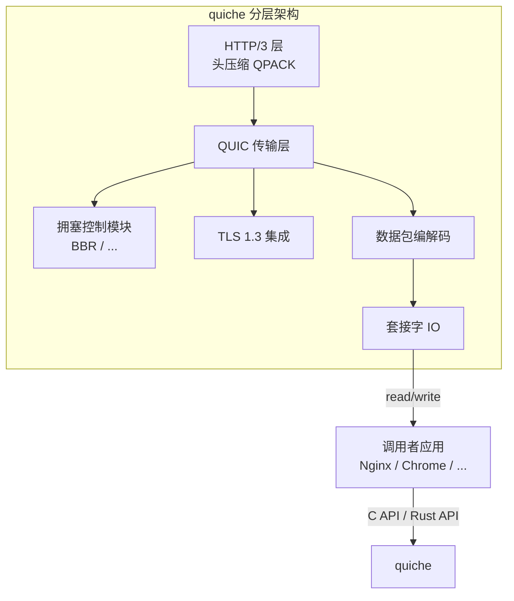
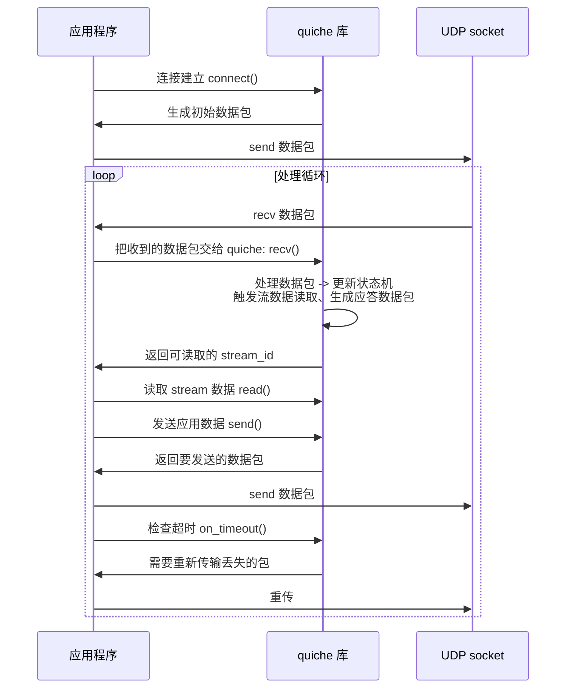

# quiche 项目概览

Cloudflare quiche 是一个用 Rust 编写的**IETF QUIC 和 HTTP/3 协议实现**，同时支持 QUIC 传输层和 HTTP/3 应用层。

## 项目信息

- **官方地址**: https://github.com/cloudflare/quiche
- **编程语言**: 主要 Rust，对外提供 C 绑定（`bindings`）方便其他语言集成
- **主要维护者**: Cloudflare
- **支持标准**:
  - QUIC: RFC 9000 (核心), RFC 9001 (TLS), RFC 9002 (恢复)
  - HTTP/3: RFC 9114
  - QPACK: RFC 9204

## 设计目标

quiche 的设计遵循几个核心原则：

1. **实现正确** → 严格遵循 IETF 规范，通过所有标准化测试
2. **易于集成** → 提供简洁 C API，方便嵌入到其他应用（比如 Nginx、Chrome 都在用）
3. **性能优先** → 零拷贝设计，尽量减少内存分配和拷贝
4. **不处理 IO** → quiche 本身只做协议编解码和状态处理，**不负责实际 socket 读写**，IO 由调用者处理
5. **可插拔拥塞控制** → 支持不同拥塞控制算法，默认提供 BBR

## 整体架构图



## quiche 不做什么

很重要的一点：quiche **不是完整的 QUIC 服务器/客户端**，它是一个**协议库**：

✅ 做的事情：
- 解析和生成 QUIC 数据包
- 维护连接状态和流状态
- 处理握手、拥塞控制、流量控制
- 解析和生成 HTTP/3 帧
- QPACK 头压缩

❌ 不做的事情：
- 不负责监听 UDP socket
- 不负责发送和接收数据包（由调用者把读到的数据交给 quiche，quiche 处理完，调用者把生成的数据发出去）
- 不负责处理超时定时器（由调用者驱动，调用 quiche 提供的超时检查函数）

这种设计的好处是极大提升了集成灵活性，可以嵌入到各种现有项目中。

## 整体处理流程



## 目录结构（源代码）

```
quiche/
├── src/
│   ├── connection.rs    # 连接主结构和状态机
│   ├── stream.rs        # 流处理
│   ├── packet.rs        # 数据包编解码
│   ├── recovery.rs      # 丢包恢复、ACK处理
│   ├── congestion.rs    # 拥塞控制接口和BBR实现
│   ├── flow_control.rs  # 流量控制
│   ├── tls.rs           # TLS接口抽象
│   ├── crypto.rs        # 加密解密
│   ├── qpack.rs         # QPACK头压缩
│   ├── h3.rs            # HTTP/3 处理
│   └── client.rs / server.rs
├── bindings/
│   └── quiche.h         # C API 头文件
└── examples/
    └── quiche-client / quiche-server  # 示例客户端服务器
```

---

下一章：[功能模块划分](./02-modules.md)
