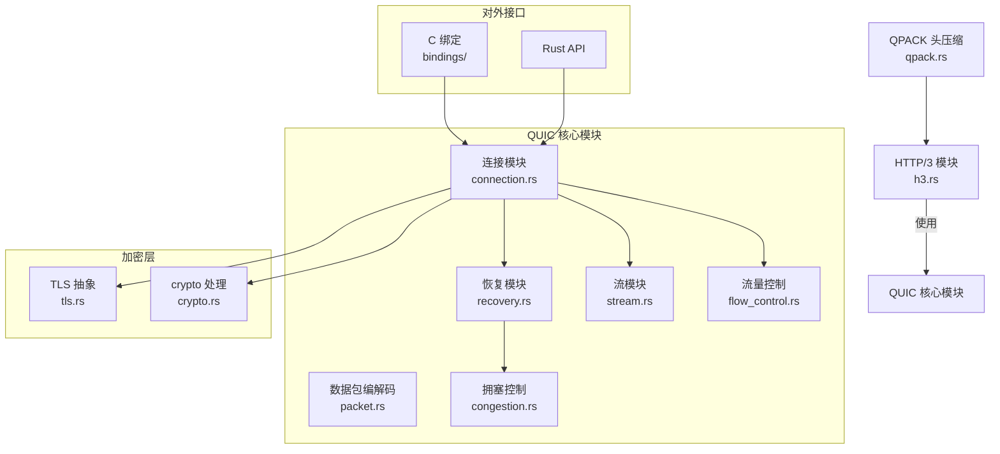

# quiche 功能模块划分

## 模块分层图

quiche 按照协议层从高到低清晰划分模块：



## 各模块职责边界

### 1. HTTP/3 模块 (`h3.rs`)

**职责：**
- HTTP/3 帧的解析和生成
- 控制流管理 (control stream)
- 推流管理 (push)
- 连接升级处理
- QPACK 编码器/解码器状态维护

**不做：**
- 不处理底层 QUIC 流的可靠性
- 不处理流量控制

**主要数据结构：**
- `Connection` — HTTP/3 连接状态
- `RequestStream` — HTTP 请求流
- `ResponseStream` — HTTP 响应流

---

### 2. QPACK 模块 (`qpack.rs`)

**职责：**
- HTTP 头压缩和解压
- 维护动态表状态
- 处理编码器指令流和解码器指令流
- 处理冲突和阻塞

**核心算法：**
- 静态表 + 动态表
- 字面量编码
- 哈希索引

---

### 3. QUIC 连接模块 (`connection.rs`)

这是 quiche **最核心的模块**，协调所有其他模块工作。

**职责：**
- 维护整个 QUIC 连接的顶层状态
- 处理握手过程
- 处理连接级 PUDO (packets, acks, timers)
- 管理所有流的生命周期
- 封装对外 API（connect / accept / recv / send / ...）

**不做：**
- 具体的拥塞控制计算交给 `congestion.rs`
- 具体的丢包恢复计算交给 `recovery.rs`
- 具体的流量控制检查交给 `flow_control.rs`

---

### 4. QUIC 流模块 (`stream.rs`)

**职责：**
- 单个 QUIC 流的状态管理
- 用户应用数据的排队
- 流内有序递送
- 流量控制窗口更新
- 流关闭处理

**主要概念：**
- **发送流**：应用写数据 → 放入发送队列 → 被打包成数据包发送
- **接收流**：收到的数据 → 放入接收缓冲区 → 应用读取
- **双向流**：同时支持发送和接收
- **单向流**：只支持一个方向发送

**流 ID 分配规则：**
```
客户端发起双向流:  0b00 (奇数 + 0)
客户端发起单向流:  0b01 (奇数 + 1)
服务器发起双向流:  0b10 (偶数 + 0)
服务器发起单向流:  0b11 (偶数 + 1)
```

---

### 5. 数据包编解码模块 (`packet.rs`)

**职责：**
- 解析收到的 UDP 数据报 → 识别长包头/短包头 → 提取加密载荷
- 生成待发送的 QUIC 数据包 → 正确填充各个字段
- 处理受保护数据包的解密和加密
- 处理帧的解析和生成：ACK帧、STREAM帧、CRYPTO帧、MAX_DATA帧等等

**QUIC 包类型：**

| 类型 | 用途 |
|------|------|
| 初始包 (Initial) | 握手开始时使用，含有第一次飞行数据 |
| 0-RTT 包 (Early Data) | 早期数据，用于0-RTT握手 |
| 握手包 (Handshake) | 握手过程中使用 |
| 1-RTT 包 (Application Data) | 应用数据，握手完成后使用 |
| 重试包 (Retry) | 服务器用来做地址验证 |

**帧类型（部分常见）：**

| 帧 | 用途 |
|----|------|
| PADDING | 填充，保证最小包大小 |
| CRYPTO | 传输 TLS 握手数据 |
| STREAM | 传输应用数据 |
| ACK | 确认已收到的包，提供丢包检测信息 |
| MAX_DATA | 连接级流量控制窗口更新 |
| MAX_STREAM_DATA | 流级流量控制窗口更新 |
| STREAMS_BLOCKED | 流数量达到上限阻塞 |
| NEW_CONNECTION_ID | 下发新的连接ID用于迁移 |
| RETIRE_CONNECTION_ID | 建议对端 retired 某个连接ID |
| PATH_CHALLENGE / PATH_RESPONSE | 路径探测 |
| CONNECTION_CLOSE | 关闭连接携带错误码 |

---

### 6. 流量控制模块 (`flow_control.rs`)

**职责：**
- 实现**连接级**流量控制窗口
- 实现**流级**流量控制窗口
- 检查发送是否超过窗口限制
- 处理对端发来的窗口更新
- 计算何时需要发送窗口更新给对端

**两层流量控制：**
```
连接级窗口: 限制整个连接所有流的总发送数据量
    ↳ 每个流都有自己的流级窗口: 限制单个流的发送量
```

---

### 7. 恢复模块 (`recovery.rs`)

**职责：**
- ACK 处理 → 知道哪些包被对端确认了
- 丢包检测 → 根据 ACK 范围判断哪些包丢了
- 超时计算 → PTO 超时计算
- 重传调度 → 标记丢包需要重传
- 带宽估计 → 配合拥塞控制模块

**核心机制：**
- **NewReno 风格**丢包检测
- 使用 ACK 中 SACK 范围快速检测丢包
- 基于时间的丢包检测（超时）

---

### 8. 拥塞控制模块 (`congestion.rs`)

**职责：**
- 定义拥塞控制通用接口
- 默认实现 BBRv2 拥塞控制
- 支持 Cubic 作为可选
- 维护拥塞窗口、 pacing 速率

**接口设计：**
-  trait `CongestionController` — 定义接口，方便替换算法
-  `BbrCongestionController` — 默认实现
-  `CubicCongestionController` — 可选实现

**BBR 核心思想：**
- 不基于丢包判断拥塞，基于**带宽测量**和**最小RTT**
- 计算 BDP (带宽 × 最小RTT) 作为发送量上限
- 性能比 Cubic 更好，尤其在长肥管道

---

### 9. TLS 集成模块 (`tls.rs`)

**职责：**
- 定义 TLS 抽象接口
- quiche 本身不实现 TLS 1.3，**依赖 BoringSSL**
- 封装 BoringSSL 调用
- 处理握手 secrets 导出
- 处理 early data (0-RTT)

为什么不自己实现 TLS 1.3？因为 TLS 1.3 密码学实现要求很高，安全第一，用经过广泛审核的 BoringSSL。

---

### 10. 加密处理模块 (`crypto.rs`)

**职责：**
- 根据 TLS 导出的密钥，对 QUIC 数据包进行加密和解密
- 处理 packet 保护和去保护
- 处理不同加密等级 (Initial / Handshake / Application) 的密钥更新

**QUIC 的加密设计：**
每个加密等级有独立的密钥：
- Initial 密钥对 → 初始握手用
- Handshake 密钥对 → 握手过程用
- Application 密钥对 → 应用数据用

---

### 11. 对外接口模块

**Rust API** — 供 Rust 程序直接调用
**C 绑定** (`bindings/quiche.h`) — 供 C/C++ 程序调用，Nginx 就是用这个集成

## 模块依赖关系总结

```
最顶层:
  HTTP/3 → QPACK ↓

QUIC 核心:
  连接 → 流 → 流量控制 ↓
  连接 → 恢复 → 拥塞控制 ↓
  连接 → 数据包编解码 ↓

加密层:
  连接 → TLS → Crypto ↓

对外:
  应用 → C API / Rust API → 连接
```

没有循环依赖，严格从上到下调用。

---

上一章：[项目概览](./01-overview.md)
下一章：[核心数据结构](./03-data-structures.md)
