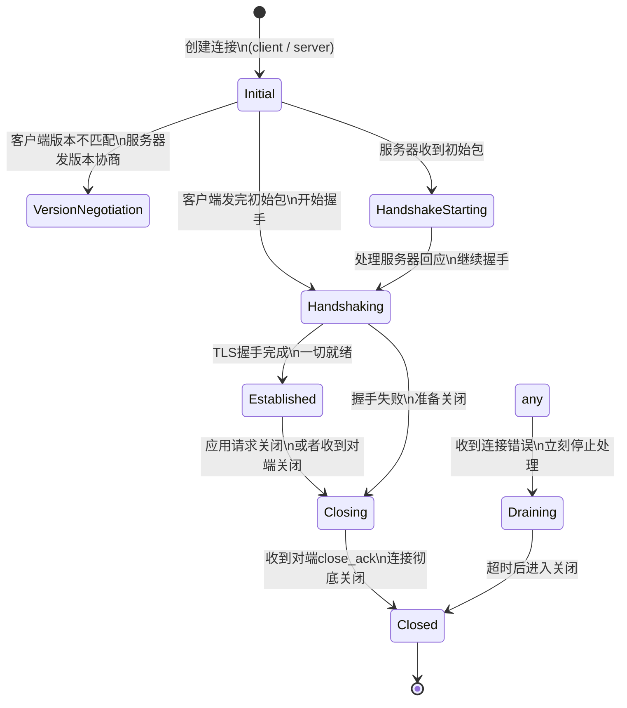
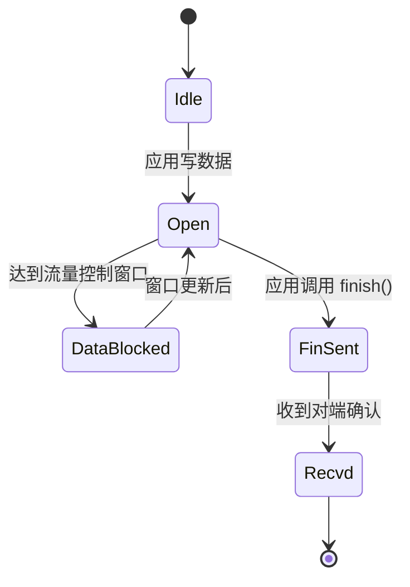
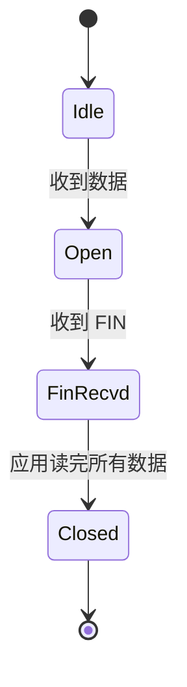

# quiche 连接状态机

QUIC 连接的整个生命周期由状态机驱动，理解状态扭转是理解连接建立、关闭和错误处理的关键。

## quiche 中的状态定义

`quiche::ConnectionState` 枚举定义了所有可能的状态：

```rust
pub enum State {
    // 刚刚创建，还没开始处理
    Initial,
    // 服务器版本协商中
    VersionNegotiation,
    // 收到客户端初始包，等待处理
    HandshakeStarting,
    // 握手进行中
    Handshaking,
    // 握手完成，应用数据可以传输了
    Established,
    // 开始关闭连接
    Closing,
    // 收到对端关闭确认，彻底关闭
    Closed,
    // 收到错误，直接关闭
    Draining,
}
```

## 完整状态转移图



## 各个状态详解

### 1. Initial 状态

**何时进入：**
- 当调用 `Connection::connect()` 客户端创建新连接
- 当调用 `Connection::accept()` 服务器准备接受新连接

**做什么：**
- 初始化连接参数
- 生成初始连接ID
- 准备好第一个 Initial 数据包

**何时转出：**
- 客户端：初始包生成完 → 进入 `Handshaking`
- 服务器：收到第一个初始包 → 进入 `HandshakeStarting`
- 如果版本不匹配 → 进入 `VersionNegotiation`

---

### 2. VersionNegotiation 状态

**何时进入：**
- 服务器收到客户端使用了不支持的 QUIC 版本

**做什么：**
- 服务器生成一个版本协商包，列出自己支持的所有版本，发给客户端
- 客户端重新发起连接用双方都支持的版本

**何时转出：**
- 服务器发完版本协商包 → 回到 `Initial` 等待客户端重试
- 客户端收到版本协商 → 重新 connect 使用新版本

---

### 3. HandshakeStarting 状态

这是服务器才会经历的过渡状态。

**何时进入：**
- 服务器收到客户端第一个 Initial 包，验证通过

**做什么：**
- 验证地址有效性（如果需要 Cookie）
- 生成 ServerHello 等握手数据

**何时转出：**
- 处理完成，发送完握手包 → `Handshaking`

---

### 4. Handshaking 状态

**何时进入：**
- 握手开始了，但还没完成

**做什么：**
- 处理 TLS 握手消息
- 交换 crypto 数据
- 生成密钥
- 确认握手完成条件

**握手完成条件：**
- 双方 TLS 握手都完成
- 双方 Finished 消息都被确认收到
- 加密秘钥都导出成功

**何时转出：**
- 握手完成 → `Established`
- 握手出错 → `Closing`

---

### 5. Established 状态

这是连接正常工作的状态，应用数据开始传输。

**何时进入：**
- TLS 握手双方都完成了

**做什么：**
- 处理应用数据包
- 收发 STREAM 帧
- 处理 ACK、丢包重传、拥塞控制
- 一切正常工作

**保持多久：**
- 一直保持，直到一方请求关闭连接

**何时转出：**
- 应用调用 close() → `Closing`
- 收到对端 CONNECTION_CLOSE → `Closing`
- 超时太久没响应 → `Closing` / `Draining`

---

### 6. Closing 状态

**何时进入：**
- 本端或对端发起关闭连接

**做什么：**
- 发送 CONNECTION_CLOSE 帧
- 等待对端确认
- 清理还在发送但未确认的数据

**超时处理：**
- 如果在 `max_idle_timeout` 时间内还没收到对端确认 → 直接进入 `Closed`

**何时转出：**
- 收到对端的 CONNECTION_CLOSE 确认 → `Closed`
- 超时 → `Closed`

---

### 7. Draining 状态

**何时进入：**
- 本端检测到连接出错（协议错误、加密错误等）
- 收到对端错误通知

**做什么：**
- 停止处理任何输入
- 不发送任何新数据
- 等待一段时间让缓冲区清空
- 直接彻底关闭

**这和 Closing 区别：**
- `Closing` 是优雅关闭，走正常关闭流程，确认对端收到关闭消息
- `Draining` 是立刻停止，不管对端，马上走人

---

### 8. Closed 状态

**何时进入：**
- 关闭流程完成

**做什么：**
- 连接彻底终结，所有资源可以释放了

---

## 流层面的状态机

除了连接级状态机，每个 QUIC 流也有自己的状态机：

### 发送流状态



### 接收流状态



---

## 关键扭转触发点

### 谁触发状态变化？

quiche 设计中，**调用者驱动**所有状态变化：

1. 调用者收到 UDP 数据包 → 调用 `connection.recv()` → quiche 处理数据 → 可能触发状态变化
2. 调用者定时器超时 → 调用 `connection.on_timeout()` → quiche 检查超时 → 触发状态变化
3. 应用调用 API → `connect()` / `close()` / `send()` → 触发状态变化

quiche 自己不处理定时器，不处理 IO，完全由调用者喂数据、抽结果。

### 握手完成判定条件

quiche 判断握手完成只看一件事：

```rust
tls.is_handshaken() && peer_finished && local_finished
```

- TLS 层告诉你握手完成了
- 你的 Finished 已经被对端 ACK 了
- 你已经收到了对端的 Finished

三个条件同时满足 → 进入 `Established`

---

## 常见异常处理路径

| 场景 | 路径 |
|------|------|
| 客户端连错版本 | Initial → VersionNegotiation → Initial (重试) |
| 握手过程中对端发了错误 | Handshaking → Closing → Closed |
| 超时没收到任何回应 | Established → Closing → Closed |
| 检测到协议错误 | 任何状态 → Draining → Closed |
| 应用主动关闭 | Established → Closing → Closed |

---

## 与 HTTP/3 状态的关联

当 QUIC 连接进入 `Established` 后，HTTP/3 层才开始工作：

- QUIC 连接 Established → HTTP/3 打开控制流 → 发送 SETTINGS 帧 → HTTP/3 进入可用状态
- 之后才能创建请求流发送 HTTP 请求

---

上一章：[核心数据结构](./03-data-structures.md)
下一章：[HTTP/3 流处理流程](./05-stream-processing.md)
