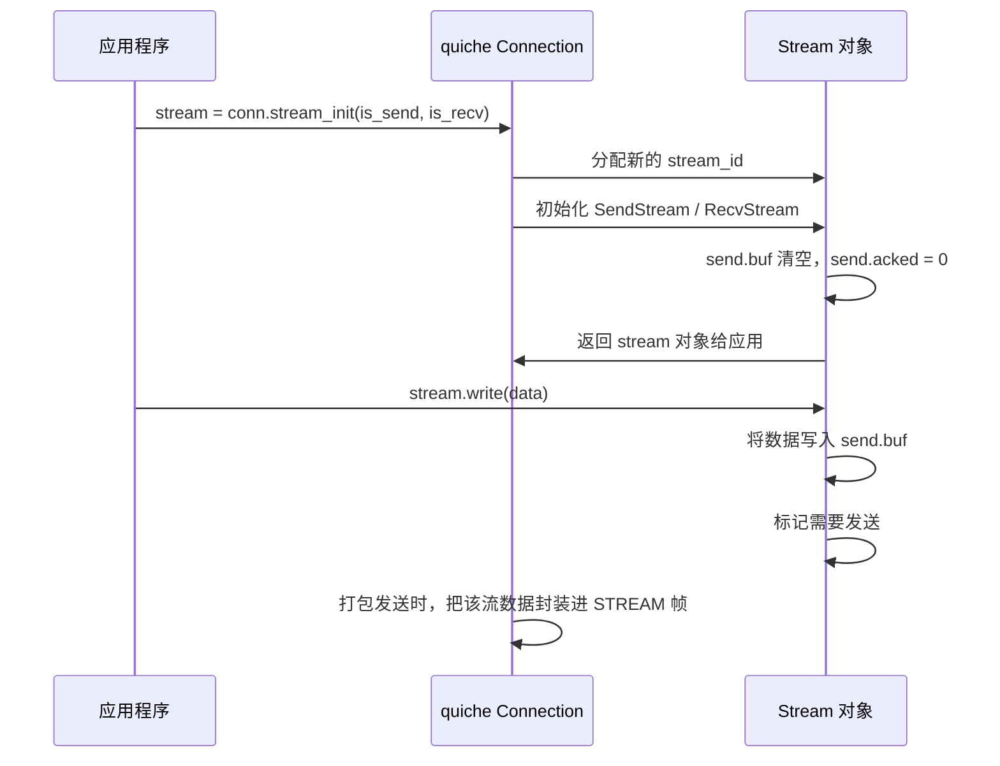
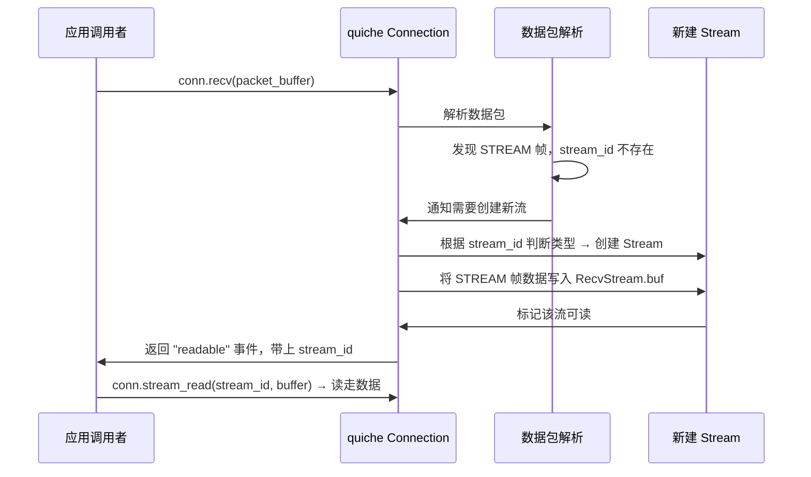
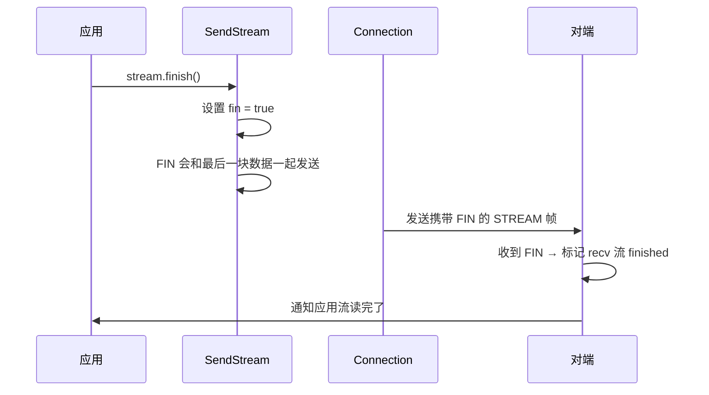

# HTTP/3 流处理流程

QUIC 的一个核心创新就是 **流模型**：在一个 UDP 连接内多路复用多个独立流，每个流独立保证有序，不队头阻塞。这一章讲解流从创建到关闭的完整流程。

## QUIC 流基础概念

### 流的类型

| 类型 | 发起方 | ID 最低位 | 用途 |
|------|--------|-----------|------|
| 客户端双向流 | 客户端 | 0x00 | 客户端发起请求，服务器响应 |
| 客户端单向流 | 客户端 | 0x01 | 客户端只发不收 |
| 服务器双向流 | 服务器 | 0x10 | 服务器主动发起 |
| 服务器单向流 | 服务器 | 0x11 | 服务器只发不收 |

HTTP/3 中：
- 每个 HTTP 请求/响应 对应一个**双向流**（客户端发起）
- 控制流、QPACK 编码/解码器流是特殊的单向流

### 流 ID 分配规则

- 流 ID 是 62 位整数
- 发起方轮流分配：客户端用奇数 ID (0, 2, 4...)，服务器用偶数 ID (1, 3, 5...)
- 每个新流 ID 递增 2
- 对端可以知道当前最多创建了多少流，用于流数量流控

## 流创建流程

### 发送端（应用要发送数据）



**关键点：**
1. quiche 只是把数据写到流的发送缓冲区，**不立刻发送**
2. 等到下一次打包发送的时候，把多个流的数据拼到同一个 QUIC 数据包里
3. 这样可以提高传输效率，减少包头开销

---

### 接收端（收到新流）



**关键点：**
- 被动创建：收到第一个属于该流的 STREAM 帧才创建
- 创建后立刻把数据放进去
- 通知调用者有新流可读

## 数据发送流程

### 应用写入数据 → 打包发送

```
应用调用 stream.write(data)
        ↓
数据追加到 stream.send.buf
        ↓
标记该流有数据待发送
        ↓
下次连接打包发送 (conn.send())：
   遍历所有有待发送数据的流
   按优先级取数据
   封装成 STREAM 帧
   拼入 QUIC 数据包
   标记为已发送，保存到 sent_packets 等待 ACK
        ↓
返回组装好的数据包给调用者
调用者通过 UDP socket 发送出去
```

**流的调度：**
quiche 目前是简单的轮询调度，从每个有数据的流取一些数据，直到数据包装满。这样保证了公平性。

## 数据接收流程

### 收到数据 → 应用读取

```
收到数据包 → 解析出 STREAM 帧
        ↓
根据 stream_id 找到对应的 Stream
        ↓
检查偏移量是否在流量控制窗口内
        ↓
如果是乱序到达，放到正确位置
        ↓
数据写入 stream.recv.buf
        ↓
如果有新数据连成一片，标记流可读
        ↓
应用调用 stream.read(buffer)
        ↓
从 recv.buf 移出数据返回给应用
缓冲区腾出空间
        ↓
如果接收窗口用了一定比例，触发窗口更新发送给对端
```

**乱序处理：**
QUIC 允许乱序发送，所以接收端可能先收到后面的数据，后收到前面的数据。quiche 会在 `recv.buf` 里留好空位，等前面的数据到了再一起给应用。

## 流关闭流程

### 优雅关闭（应用写完了）



**FIN 就是流的结束标记，表示"我这边已经写完了"。**

### 对端关闭处理

收到对端 FIN：
1. 标记接收流已经结束
2. 所有数据都收到了，交给应用读取
3. 应用读完后，流可以释放了

### 立刻重置流

如果想立刻关流、异常中止，可以发送 RST_STREAM 帧：

```
发送端: stream.reset(error_code) → 发 RST_STREAM 帧
接收端: 收到 RST_STREAM → 立刻关闭流，丢弃所有未读数据，通知应用错误码
```

## HTTP/3 层流映射

HTTP/3 在 QUIC 流模型之上，定义了 HTTP 语义映射：

```
QUIC 连接
 ├─> 控制流 (服务器单向流) → 发送 SETTINGS, GOAWAY 等控制帧
 ├─> QPACK 编码器流 (客户端单向流)
 ├─> QPACK 解码器流 (服务器单向流)
 ├─> 请求流 1 (双向流) → 请求 / 响应
 ├─> 请求流 2 (双向流) → 另一个并发请求
 └─> ... 更多请求流
```

**每个 HTTP 请求对应一个独立 QUIC 双向流**：
- 客户端发送 HTTP 头 + body → 流结束
- 服务器发送 HTTP 头 + body → 流结束
- 一个请求完全独立，不影响其他请求

对比 HTTP/2：HTTP/2 也是多路复用，但在一个 TCP 连接上，TCP 还是有序的，丢了一个包会阻塞所有流。QUIC 每个流独立 ACK，丢包只重传丢的那个流，不影响其他流。这就是**无队头阻塞**的真正含义。

## 流的流量控制

两层流量控制：

1. **流级**：每个流接收窗口大小，限制单个流能发送多少数据
2. **连接级**：整个连接所有流加起来的总接收窗口大小

quiche 在收到数据后：

```
检查流级窗口是否足够
 ↓
检查连接级窗口是否足够
 ↓
如果超了 → 停止接收，不发送确认
 ↓
应用读走数据 → 缓冲区腾出空间 → 计算新窗口 → 发送 MAX_STREAM_DATA / MAX_DATA 帧
```

## 流回收

什么时候流资源可以被释放？

条件：
1. 本端发送完了（FIN 已经被对端确认）
2. 本端接收完了（已经收到对端 FIN，并且应用已经读完）
3. 所有数据都已经被 ACK

满足条件后，quiche 会把流从 `send_streams` / `recv_streams` 映射中移除，内存自动释放。

---

## 完整例子：一个 HTTP GET 请求处理流程

```
客户端:
  1. QUIC 握手完成 → 进入 Established
  2. HTTP/3 发送 SETTINGS → 打开控制流
  3. 新建一个双向流 stream_id = 0
  4. 编码 HEADERS 帧 → 写入流
  5. 发完头 → 发 DATA 帧（如果有 body）→ FIN
  6. quiche 打包成 QUIC 数据包 → 发送

服务器:
  1. 收到数据包 → 解析出 STREAM 帧 → stream 0 不存在 → 创建流
  2. 读取数据 → 解析 HEADERS → HTTP 头完整了
  3. 通知应用有新请求 → 应用处理请求
  4. 应用生成响应 → 编码 HEADERS → 写入流
  5. 编码 DATA → 写入流 → FIN
  6. quiche 打包发送

客户端:
  1. 收到响应 → 解析 HEADERS → 解析 DATA
  2. 通知应用响应可读 → 应用读取处理
  3. 双方都收到 FIN → 流关闭 → 资源回收
```

---

上一章：[连接状态机](./04-connection-statemachine.md)
下一章：[流量控制](./06-flow-control.md)
