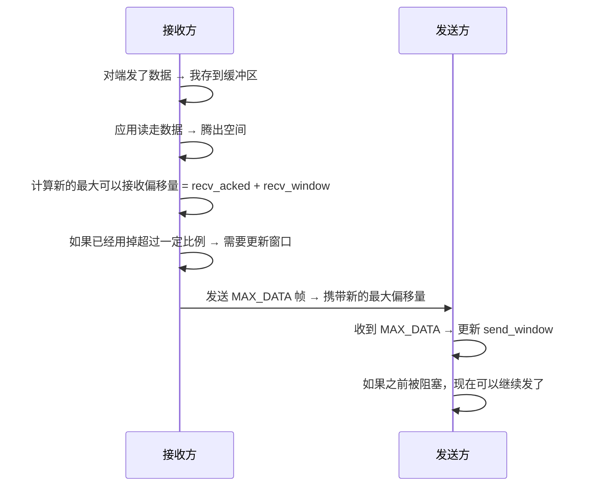

# quiche 流量控制实现

流量控制 (Flow Control) 是 QUIC 中防止一方发太快把另一方内存撑爆的机制。quiche 实现了标准 QUIC 两层流量控制。

## 为什么需要流量控制？

- 如果发送方源源不断发数据，接收方应用一直不读，接收缓冲区会一直涨，最终内存溢出崩溃
- 流量控制就是让发送方知道接收方现在还能收多少数据，超了就不能发了
- QUIC 设计了两层流量控制，更灵活

## 两层流量控制架构

```
┌─────────────────────────────────────────────┐
│ 连接级流量控制                                │
│  - 限制整个连接所有流总共能发送多少数据         │
└─────────────────────────────────────────────┘
        ▼
┌─────────────────────────────────────────────┐
│ 流级流量控制                                  │
│  - 限制单个流能发送多少数据                    │
└─────────────────────────────────────────────┘
```

发送方必须同时满足两个窗口限制才能发数据：
```
已发送数据 < 连接级窗口 AND 已发送数据 < 流级窗口
```

## 连接级流量控制实现

### 数据结构

```rust
// 在 FlowControl 结构体中
pub struct FlowControl {
    // 我作为接收方：我能接收的总数据量
    recv_window: u64,       // 窗口大小
    recv_acked: u64,       // 已经被对端确认的已经消费掉的偏移量
    // 我作为发送方：对端给我的总窗口
    send_window: u64,       // 对端允许我发的总窗口
    send_used: u64,         // 我已经用了多少
    ...
}
```

### 工作流程

**接收方向发送方更新窗口：**



### 发送方检查是否可以发送

每次要发数据之前：

```rust
if self.flow_ctrl.send_used() + len > self.flow_ctrl.send_window {
    // 超过连接级窗口 → 不能发，阻塞
    return WouldBlock;
}
```

## 流级流量控制实现

### 数据结构

```rust
// 在 RecvStream 中
pub struct RecvStream {
    max_data: u64,  // 我能接收这个流的最大偏移量
    ...
}

// 在 SendStream 中
pub struct SendStream {
    max_data: u64,  // 对端允许我发的最大偏移量
    ...
}
```

### 流程和连接级非常相似：

1. 接收端：应用读走数据 → 腾出空间 → 如果增长了窗口 → 发 `MAX_STREAM_DATA` 给发送端
2. 发送端：收到 `MAX_STREAM_DATA` → 更新 `max_data` → 如果之前阻塞现在继续发

## 什么时候需要发送窗口更新？

为了减少不必要的流量，quiche 不是一有空间就发窗口更新：

```rust
// 只有当新的最大偏移量 - 上次发送的最大偏移量 >= 窗口大小 / 8
// 才发送一次更新
```

这是经典的**流量控制更新节流**：减少小包数量，牺牲一点点一点点窗口利用率，减少帧数量，整体更高效。

## 检查发送是否允许

在发送数据给某个流之前，要过两关：

```rust
// 第一关：流级窗口检查
if stream.offset() + len > stream.send_max_data() {
    // 流级窗口超了 → 标记流阻塞，不能发
    stream.set_blocked(true);
    // 如果对端还没收到我们的流阻塞 → 发 STREAMS_BLOCKED 帧
    send blocked frame ...
    return Err(Blocked);
}

// 第二关：连接级窗口检查
if conn.flow_ctrl.send_used() + len > conn.flow_ctrl.send_window {
    // 连接级窗口超了 → 标记连接阻塞
    conn.flow_ctrl.set_blocked(true);
    send BLOCKED frame ...
    return Err(Blocked);
}

// 两关都过了 → 可以发！
conn.flow_ctrl.increase_send_used(len);
stream.increase_sent(len);
真正发送数据...
```

## 流数量的流量控制

除了数据量流量控制，QUIC 还有**流数量**限制：

- 对端最多能给我开多少个并发流
- 如果超过限制，不能再开新流

quiche 中处理：

```
客户端想开新流 → 检查当前已打开流数量 < 服务器允许的最大并发流 → 允许 / 拒绝
如果拒绝 → 发 STREAMS_BLOCKED 帧告诉对端

对端想开新流超过我允许的数量 → 直接拒绝，错误是 STREAM_LIMIT_ERROR
```

## 流量控制错误处理

如果对端不顾窗口限制硬要多发：

```
对端发送数据偏移超过我通告的最大窗口 →
    这是流量控制违规 →
    关闭连接 → 错误码 FLOW_CONTROL_ERROR
```

必须严格遵守，不遵守就关连接。

## 初始窗口大小

quiche 默认值（符合 RFC 推荐）：

- 连接级初始窗口：`(1 << 18) = 262144` 字节 = 256KB
- 流级初始窗口：`(1 << 16) = 65536` 字节 = 64KB

可以在创建连接时自定义。

## 举个完整例子

```
初始状态:
  连接级窗口: 服务器允许客户端发 256KB
  流A窗口: 允许发 64KB
  流B窗口: 允许发 64KB

客户端:
  给流A发 40KB → 流A用了40K，连接总共用了40K → 都没超
  给流B发 40KB → 流B用了40K，连接总共用了80K → 都没超

服务器:
  应用读走流A 30KB → 流A窗口腾出 30KB → 新的最大偏移量增加 30K
  增长超过 1/8 → 发 MAX_STREAM_DATA 给客户端
  连接总共腾出 30KB → 需要发 MAX_DATA 更新连接级窗口

客户端收到更新:
  更新流A窗口和连接窗口 → 可以继续发了
```

## 和 TCP 流量控制对比

| 特性 | TCP | QUIC |
|------|-----|------|
| 窗口级别 | 只有连接级 | 连接级 + 流级 |
| 阻塞范围 | 整个连接阻塞 | 只有超了窗口的那个流阻塞 |
| 乱序不影响 | 否，丢包阻塞整个连接 | 是，流量控制只限制单个流 |

QUIC 这种设计更适合多路复用，一个流被流量控制了不影响其他流。

---

上一章：[HTTP/3 流处理](./05-stream-processing.md)
下一章：[拥塞控制](./07-congestion-control.md)
