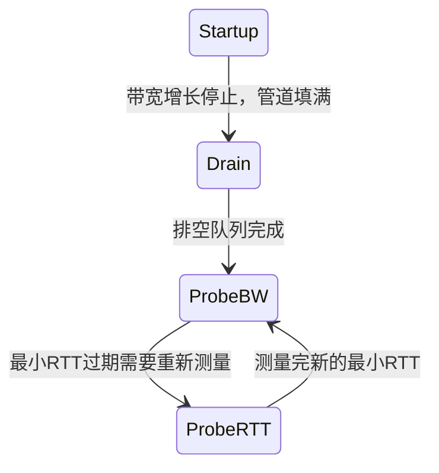

# quiche 拥塞控制实现

拥塞控制 (Congestion Control) 是决定「现在能发多少数据」的核心模块，目的是避免网络拥塞，同时尽量利用带宽。quiche 默认实现了 BBRv2，也支持 Cubic。

## 拥塞控制要解决什么问题

- 网络带宽是有限的，如果一下子发太多，路由器会丢包
- 丢包太多重传太多，性能反而下降
- 拥塞控制就是找到一个合适的发送速率，既不挤爆网络，又能跑满带宽
- QUIC 拥塞控制在端系统实现，和 TCP 类似，但设计更灵活

## quiche 的拥塞控制架构

quiche 设计了**抽象接口 + 具体实现**的架构：

```rust
pub trait CongestionController {
    // 包被确认了，更新状态
    fn on_ack(&mut self, pn: PacketNumber, sent_bytes: usize, acked: bool, latest_rtt: Duration,
              now: Instant, stats: &mut Stats);
    // 包丢了，更新状态
    fn on_lost(&mut self, lost_bytes: usize, now: Instant, stats: &mut Stats);
    // 当前拥塞窗口多大（最多可以发多少字节 in-flight）
    fn window(&self) -> usize;
    // 当前 pacing 发送速率（字节每秒）
    fn pacing_rate(&self) -> u64;
    // 发了一个包，更新状态
    fn on_packet_sent(&mut self, pn: PacketNumber, bytes: usize, now: Instant);
    ...
}
```

想换算法就换，不用改 QUIC 核心代码，这是很好的设计。

## 默认算法：BBRv2

quiche 默认启用 BBRv2，这是 Google 开发的基于带宽建模的拥塞控制算法。

### BBR 核心思想

BBR 不依靠丢包判断拥塞，而是**直接测量瓶颈带宽和最小 RTT**，然后根据这两个计算应该发送多少：

```
BDP = 瓶颈带宽 × 最小RTT
BDP 就是带宽时延积，表示网络管道能装下多少字节

拥塞窗口 cwnd = BBR × 增益系数
```

也就是说：
- BBR 知道管道多大，就往里面灌多少水
- 不会像基于丢包的算法那样，丢包了才减窗口，导致管道利用率低

### BBR 状态机

BBR 自己有一个状态机：



各个状态作用：

| 状态 | 作用 |
|------|------|
| Startup | 启动阶段，快速增加发送速率，探测带宽上限 |
| Drain | 把 Startup 阶段积累的排队排空 |
| ProbeBW | 稳定阶段，周期性探测更好的带宽，保持最高发送速率 |
| ProbeRTT | 每隔一段时间探测新的最小RTT，应对网络路径变化 |

### BBRv2 和 BBRv1 的区别

- BBRv2 在有多个流争用带宽时更公平
- BBRv2 在有随机丢包（不是拥塞丢包）的情况下更稳定
- BBRv2 对 bufferbloat 处理更好

quiche 默认用的就是 BBRv2，Google 推荐。

## 可选算法：Cubic

quiche 也实现了 Cubic，这是现在 TCP 最常用的基于丢包的拥塞控制算法。

### Cubic 核心思想

- 丢包前一直增长拥塞窗口
- 收到丢包信号，窗口按三次函数曲线降低
- 比 TCP 旧的 Reno 算法增长更快，更适合长肥管道

想用 Cubic 就编译的时候开 feature 开关：
```
cargo build --features "cubic" --no-default-features
```

## 核心数据结构（BBR）

```rust
pub struct BbrCongestionController {
    // 当前状态
    state: BbrState,
    // 测量到的瓶颈带宽（发送速率）
    bw: Bandwidth,
    // 最近几个采样的带宽最大值
    bw_hi: Bandwidth,
    // 最近几个采样的带宽最小值
    bw_lo: Bandwidth,
    // 最小 RTT
    min_rtt: Duration,
    // BDP = 带宽 × min_rtt
    target_cwnd: usize,
    // 当前拥塞窗口
    cwnd: usize,
    //  pacing 速率
    pacing_gain: f64,
    // 循环探测相位
    cycle_idx: usize,
    ...
}
```

## 发送量计算流程

每次发送数据包之前：

```
quiche connection 要发送数据包
    ↓
问拥塞控制: 现在窗口多大(window())？速率多大(pacing_rate())？
    ↓
检查当前 in_flight (已发未确认字节数) < 窗口:
    如果小于 → 允许发送
    如果大于 → 不能发，等待
    ↓
发送成功 → 调用 on_packet_sent() → 拥塞控制更新状态
```

收到 ACK 之后：

```
处理 ACK → 知道哪些包被确认了
    ↓
对于每个被确认的包:
    调用拥塞控制.on_ack() → 更新带宽估计、更新窗口
    ↓
对于每个被检测为丢失的包:
    调用拥塞控制.on_lost() → 拥塞控制减小窗口
```

## Pacing （ pacing 发送）

quiche 支持 pacing，就是控制每秒发送多少字节，不要一下子突发出去把路由器队列冲爆：

```
没有 pacing: 有多少数据一下子都发出去 → 突发 → 路由器丢包
有 pacing: 按 pacing_rate 均匀分布发送 → 平稳 → 丢包少
```

BBR 默认开启 pacing，配合 BBR 的带宽测量效果更好。

## 与丢包恢复的配合

拥塞控制和恢复模块 (`recovery.rs`) 配合工作：

```
recovery.rs → 检测到丢包 → 通知拥塞控制 → 拥塞控制调整窗口
recovery.rs → ACK 确认 → 通知拥塞控制 → 拥塞控制更新带宽估计
```

分层清晰：
- `recovery.rs` 做丢包检测、判断哪些包丢了
- `congestion.rs` 根据丢包/ACK 调整发送窗口和速率
- 职责分离，好维护

## in_flight 概念

**in_flight** = 已经发送了，但还没被确认的字节数。

拥塞窗口限制的就是 `in_flight` 不能超过窗口大小：

```
if in_flight >= cc.window() {
    不能再发了，等 ACK
} else {
    还能继续发
}
```

## 默认参数

quiche BBR 默认参数：

| 参数 | 值 |
|------|-----|
| 初始拥塞窗口 | 10 MSS ≈ 14600 字节 |
| 最小拥塞窗口 | 4 MSS ≈ 5840 字节 |
| 探测最小 RTT 间隔 | 10 秒 |
| Startup 增益 | 2.89 |

这些都是 BBR 标准推荐值。

## BBR vs Cubic 怎么选

| 场景 | 推荐 |
|------|------|
| 现代互联网，长肥管道，RTT 变化大 | BBR (默认) |
| 需要和 TCP 公平争用带宽 | Cubic |
| 大量丢包是误码不是拥塞 (比如无线链路) | BBR |
| 兼容传统 TCP 行为 | Cubic |

quiche 默认 BBR 适用于大多数场景。

---

上一章：[流量控制](./06-flow-control.md)
下一章：[TLS 1.3 处理](./08-tls-processing.md)
