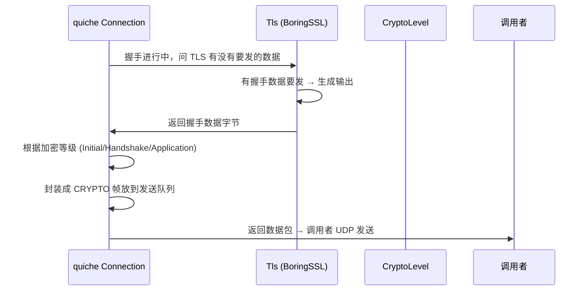
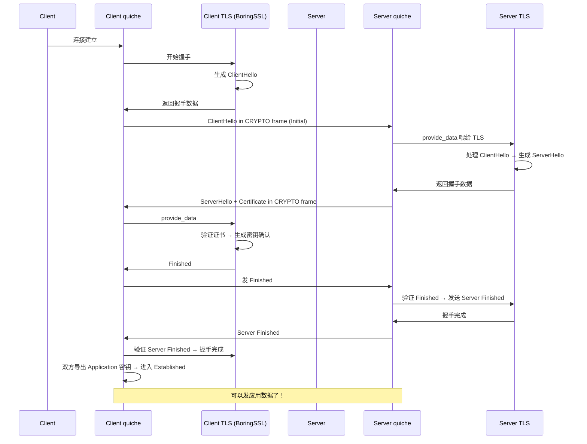

# quiche TLS 1.3 处理集成

QUIC 本身不实现 TLS 1.3 握手，quiche 集成了 BoringSSL 来做 TLS 1.3。本章讲解 quiche 怎么和 TLS 对接。

## QUIC 为什么用 TLS 1.3

QUIC 规范要求必须使用 TLS 1.3 做握手：
1. TLS 1.3 比旧版本更快，握手可以 1-RTT 甚至 0-RTT
2. TLS 1.3 安全性更好，去掉了老的不安全加密套件
3. QUIC 整个握手过程都加密，依赖 TLS 1.3 的设计

## 架构设计：让专业的人做专业的事

quiche 的设计哲学：
- **quiche 不自己实现 TLS 1.3 和密码学**，把这块交给 BoringSSL
- quiche 只负责 TLS 消息怎么封装成 CRYPTO 帧在 QUIC 上传输
- quiche 负责从 TLS 拿到握手密钥，给 QUIC 数据包加密解密

好处：
- TLS 密码学很难写对，BoringSSL 经过全世界安全专家审计，更安全
- quiche 代码更简洁，专注做 QUIC 协议本身
- BoringSSL 升级了，quiche 自动跟着受益

## 分层结构

```
┌─────────────────┐
│   quiche 连接    │
└─────────┬───────┘
          │
          ▼
┌─────────────────┐
│  tls.rs 抽象接口 │ ← 定义 quiche 需要 TLS 做什么
└─────────┬───────┘
          │
          ▼
┌─────────────────┐
│  BoringSSL 绑定  │ ← 调用 BoringSSL SSL_CTX 等接口
└─────────┬───────┘
          │
          ▼
┌─────────────────┐
│   libcrypto     │ ← 真正做密码学运算
└─────────────────┘
```

## TLS 抽象接口设计

quiche 在 `tls.rs` 定义了 `Tls` trait：

```rust
pub trait Tls {
    // 把对端发来的 TLS 数据喂给 TLS 层
    fn provide_data(&mut self, level: CryptoLevel, buf: &[u8]) -> Result<()>;

    // 从 TLS 层取出要发给对端的数据
    fn take_data(&mut self, level: CryptoLevel, out: &mut Vec<u8>) -> Result<usize>;

    // 握手完成了吗？
    fn is_handshaken(&self) -> bool;

    // 导出 QUIC 需要的密钥
    fn export_keying_material(&self, label: &[u8], out: &mut [u8]) -> Result<()>;

    // 获取 Early Data (0-RTT) 密钥
    fn get_early_secrets(&mut self, ...) -> Result<()>;

    // 获取握手密钥
    fn get_handshake_secrets(&mut self, ...) -> Result<()>;

    // 获取应用数据密钥
    fn get_application_secrets(&mut self, ...) -> Result<()>;
}
```

**关键点：**
- 接口非常精简，只定义了 quiche 真实需要的操作
- 任何 TLS 实现只要实现这个 trait 就能接给 quiche 用，不一定要 BoringSSL

## CRYPTO 帧处理流程

TLS 握手消息不是放在 STREAM 帧里，是放在专门的 **CRYPTO 帧**里：

为什么单独用 CRYPTO 帧？
- TLS 握手数据必须按顺序发送和处理
- CRYPTO 帧自带偏移量，支持独立重传
- 和应用数据流分开，互不干扰

### 发送流程



CRYPTO 帧按加密等级分开处理：
- Initial 加密等级 → CRYPTO 帧用 Initial 密钥加密
- Handshake 加密等级 → 用 Handshake 密钥加密
- Application → 用 Application 密钥加密

### 接收流程

```
收到数据包 → 解析出 CRYPTO 帧
    ↓
根据加密等级拿到对应密钥解密
    ↓
把 CRYPTO 帧数据按偏移量放到对应加密等级的接收缓冲区
    ↓
拼接完整后，整块喂给 TLS.provide_data()
    ↓
TLS 处理握手 → 更新状态 → 生成应答数据 → 发送回去
```

**为什么要按偏移量拼接？**
- CRYPTO 帧可能被分片，可能乱序到达
- 必须等完整的数据拼好才能交给 TLS 处理

## 密钥导出流程

TLS 握手完成后，quiche 从 TLS 导出各个加密等级的密钥：

```
TLS 握手走到对应阶段 →
    quiche: 请给我 Initial 密钥 →
    TLS: 计算好给你 →
    quiche: 把密钥放到 crypto.level_keys[Initial] →
    以后 Initial 加密的数据包就用这个密钥加解密

同样流程导出 Handshake 密钥和 Application 密钥
```

**每个方向都有读写密钥：**
- 客户端写密钥 → 服务器读
- 服务器写密钥 → 客户端读
- 每个加密等级独立

## 握手完成判定

quiche 判定握手完成有几个条件：

```rust
// 条件1: TLS层说握手完成了
tls.is_handshaken()
// 条件2: 我们已经收到对端的 Finished
peer_finished
// 条件3: 我们的 Finished 已经被对方确认了
local_finished_acked
// 三个都满足 → 进入 Established 状态
```

## 0-RTT 处理流程

0-RTT 就是客户端可以在第一个消息就带上应用数据，不用等服务器回包，减少一个 RTT 延迟。

quiche 中处理流程：

**客户端:**
```
客户端有会话票证 →
    告诉 TLS 做 0-RTT →
    TLS 导出 early 密钥 →
    quiche 可以发送 early 应用数据 →
    第一个包就带握手数据 + 应用数据 →
    总共一个 RTT 就能完成握手拿到响应
```

**服务器:**
```
收到客户端第一个包 →
    验证会话票证 →
    成功导出 early 密钥 →
    可以解密 early 应用数据，直接处理请求 →
    不用等握手完成就能处理，省了一个RTT
```

0-RTT 有局限性：不支持重放攻击保护，POST 等非幂等请求别用 0-RTT。

## 加密解密数据包

quiche 拿到密钥后，就用密钥给数据包加密：

```
要发送数据包 →
    根据加密等级拿对应该等级的写密钥 →
    调用 crypto.encrypt() → 加上 AEAD 标签 →
    发送出去

收到数据包 →
    根据包类型判断加密等级 →
    拿对应读密钥 →
    调用 crypto.decrypt() → 验证 AEAD 标签，防篡改 →
    明文给上层处理
```

**AEAD 是什么？**
- 认证加密，同时保证机密性（看不懂）和完整性（改了会被发现）
- QUIC 每个包都有 AEAD 标签，被篡改了直接丢弃

## 证书验证

谁做证书验证？TLS 层（BoringSSL）做：
- 服务器发证书 → BoringSSL 验证证书链是否可信
- 验证失败 → TLS 返回错误 → quiche 关闭连接
- 验证通过 → 继续握手

quiche 也允许调用者自定义证书验证逻辑，绕过 BoringSSL 验证，方便集成测试或者自定义信任链。

## 为什么 quiche 不用 RustTLS？

quiche 默认用 BoringSSL：
- Cloudflare 自己就在 BoringSSL 社区，维护得很好
- BoringSSL 对 TLS 1.3 支持非常成熟稳定
- 性能很好
- 当然，理论上你可以实现 Tls trait 接 RustTLS，社区已经有人做了

## 整个 TLS 握手流程示意图



---

上一章：[拥塞控制](./07-congestion-control.md)
下一章：[功能串联流程](./09-integration-flow.md)
