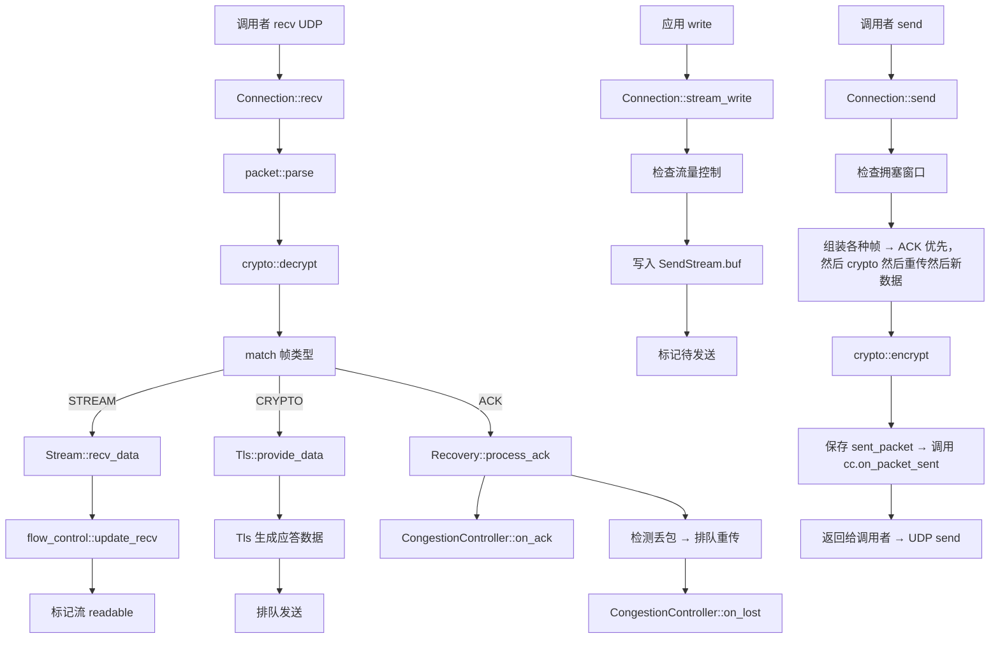

# quiche 功能串联完整流程

前面分模块讲了各个模块功能，现在我们把它们串起来，看一个完整数据包处理的从头到尾调用链。

## 总体调用架构

quiche 是一个**被动式库**：所有动作都由调用者驱动，quiche 自己不读 socket 不设定时器。

```mermaid
flowchart TD
    A[调用者事件循环] -->|超时触发| B[connection.on_timeout()]
    A -->|UDP 收到包| C[connection.recv(packet_buf)]
    A -->|应用要发数据| D[stream.write(data)]
    A -->|需要发送| E[connection.send(out_buf)]
    A -->|UDP 发送出去| F[sendto UDP socket]
```

## 完整路径一：收到 UDP 数据包 → 应用得到数据

我们一步步来看，从网卡到应用数据读取完整调用流：

```
调用者:
  recvfrom UDP socket → 得到数据包 buf [len = N]
  ↓
  调用 connection.recv(&buf)
  ↓
  connection.rs:
    检查连接状态 → 如果不是 Established / Handshaking 拒绝
    ↓
    packet.rs: 解析数据包头部
      判断长包头还是短包头
      取出 dcid 版本等信息
      取出包编号 pn
    ↓
    根据加密等级取出解密密钥
    ↓
    crypto.rs: 解密数据包 → 得到明文 payload
      (AEAD 验证标签，如果验证失败丢包)
    ↓
    packet.rs: 从 payload 里逐帧解析
      循环: 读帧头 → 判断帧类型 → 分发处理
    ↓
    针对每种帧调用 connection 对应处理函数:
```

### 不同帧类型的处理路径

**1. STREAM 帧（应用数据）**

```
connection::handle_stream_frame()
  ↓
  根据 stream_id 找流 → 不存在就新建
  ↓
  检查流量控制 → 是否超过流级窗口 / 连接级窗口
  ↓
  把数据写入 recv_stream.buf
  ↓
  如果这是有序数据拼上之后有新的连续数据可用
    标记流 readable = true
    增加 connection 可读流计数
  ↓
  更新流量控制接收统计
  ↓
  如果需要发送窗口更新 → 排队窗口更新帧
```

处理完返回给调用者，告诉调用者"这个流有数据可读了"。应用就会调用 `stream.read()` 把数据读走。

**2. CRYPTO 帧（TLS 握手数据）**

```
connection::handle_crypto_frame()
  ↓
  根据加密等级放到对应 crypto 接收缓冲区
  ↓
  拼接完整数据 → 调用 tls.provide_data() 喂给 TLS
  ↓
  TLS 处理完之后有输出要发 → 把输出取出来排队到 CRYPTO 发送队列
  ↓
  如果 TLS 握手完成了 → 触发状态机转到 Established
```

**3. ACK 帧（确认收到我的包）**

```
connection::handle_ack_frame()
  ↓
  recovery.rs: 处理 ACK
    遍历所有被 ACK 的包编号
    从 sent_packets 找出对应包
    标记为 acked
    计算这个包的 RTT → 更新 recovery 里 RTT 统计
    ↓
    congestion_controller.on_ack() → 拥塞控制更新带宽/窗口
    ↓
    检测哪些包被丢了（超过时间没被ACK）
    标记为 lost → 加入重传队列
    congestion_controller.on_lost() → 拥塞控制减小窗口
  ↓
  给调用者返回哪些包被确认了，哪些需要重传
```

**4. MAX_DATA / MAX_STREAM_DATA（流量控制窗口更新）**

```
MAX_DATA → connection.flow_control.update_send_window(new_max)
MAX_STREAM_DATA → 对应流.update_send_max_data(new_max)
  ↓
  如果之前因为窗口不够被阻塞了，现在窗口够了 → 解除阻塞
  标记可以继续发送
```

**5. CONNECTION_CLOSE（关闭连接）**

```
connection::handle_connection_close()
  ↓
  设置错误码 → 状态机转到 Closing / Closed
  ↓
  通知调用者连接关闭
```

### 数据包处理完之后

```
connection.recv() 返回给调用者:
  ↓
  返回所有有新数据可读的 stream_id 列表
  ↓
  调用者遍历这些流 → 调用 connection.stream_read() 读数据 → 交给应用处理
```

## 完整路径二：应用发送数据 → UDP 发出去

应用有数据要发送流程：

```
应用: 要发数据给 stream X
  ↓
  调用 connection.stream_write(stream_id, data)
  ↓
  connection.rs 找到流 → 调用 send_stream.write(data)
    ↓
    检查流量控制:
      if 流级窗口够 && 连接级窗口够 → 允许写入
      else → 返回 WouldBlock → 告诉应用发不动
    ↓
    数据追加到 send_stream.buf 缓冲区
    标记流有数据待发送
    标记流在发送队列里
  ↓
  返回成功 → 告诉应用写了多少字节
  ↓
  等到下一次调用 connection.send(&mut out_buf)
```

### connection.send() 打包流程

这一步要把所有待发送数据打包成一个 QUIC 数据包发给对端：

```
connection.send(out_buf)
  ↓
   检查拥塞窗口:
     if in_flight_bytes >= congestion.window() → 不让发，返回 0
  ↓
  开始组装数据包:
    先放头部 → dcid pn 等
    根据加密等级选密钥 → 留好位置放 AEAD 标签
  ↓
  按优先级加帧:
    1. 首先处理 ACK → 如果需要发 ACK，先放 ACK 帧
    2. 然后处理 CRYPTO 数据 → 握手数据优先发
    3. 然后处理重传队列里的丢包 → 先重传旧数据
    4. 然后处理新数据 → 从各个流的发送缓冲区取数据封装成 STREAM 帧
    5. 一直装，直到装不下下一个帧了
  ↓
  填满后 → 加密打包 → 计算 AEAD 标签 → 最终数据包写入 out_buf
  ↓
  把发送出去的包保存到 connection.sent_packets → 等待 ACK
  ↓
  调用拥塞控制.on_packet_sent() → 更新拥塞控制状态
  ↓
  返回打包好的数据包长度给调用者
  ↓
  调用者拿到数据 → sendto UDP socket 发送出去
```

**关键点理解：**
- 一个 QUIC 数据包可以包含多个流的数据 → 这就是多路复用
- 新数据和重传数据可以放在同一个包里 → 充分利用带宽
- quiche 不负责异步发送，你拿到数据自己发就行

## 完整路径三：超时处理

因为 QUIC 靠超时检测丢包，所以调用者需要定期调用 `on_timeout()`：

```
调用者定时器触发 → 调用 connection.on_timeout(now)
  ↓
  connection.rs:
    检查空闲超时 → 如果太久没有收到任何包 → 关闭连接
    ↓
    检查 PTO (Probe Timeout) → 如果有包超时没被ACK →
      标记丢包 → 加入重传队列
      ↓
      拥塞控制处理丢包
      ↓
      如果没有包需要发 → 发送探测包
  ↓
  返回是否需要立刻发送重传包
  ↓
  如果需要 → 调用 connection.send() → 调用者发送出去
```

## 完整例子：一次 HTTP/3 GET 请求处理总览

把所有模块串起来，看一次完整请求：

### 客户端

```
1. 应用调用 quiche::connect() → 创建 Connection → 状态 Initial
   ↓
2. 连接生成第一个 Initial 数据包 → 调用者 UDP 发给服务器
   ↓
3. 服务器回了握手包 → 调用者 connection.recv()
   ↓
4. 解析 ServerHello 证书 → TLS 验证 → 生成预主密钥 → 导出密钥
   ↓
5. 客户端发 Finished → 握手上完成 → TLS 说 done → 状态进入 Established
   ↓
6. HTTP/3 连接建立 → 新建流 → 写 HEADERS 帧 → 写 DATA 帧 → FIN
   ↓
7. connection.send() 打包成数据包 → 调用者 UDP 发送
```

### 服务器

```
1. UDP 收到客户端 Initial → connection.recv() → 处理
   ↓
2. 解析 ClientHello → TLS 处理 → 回 ServerHello 证书 → 发 Finished
   ↓
3. 握手完成 → 进入 Established
   ↓
4. 客户端发请求数据 → connection.recv() → 解析 STREAM 帧 → 放到流缓冲区 → 标记可读
   ↓
5. 应用 → stream_read() → 拿到数据 → HTTP/3 解析 HEADERS → 知道 GET 哪个路径
   ↓
6. 应用处理请求 → 生成响应 → 写 HEADERS → 写 body → FIN
   ↓
7. connection.send() 打包 → 调用者 UDP 发送给客户端
```

### 客户端收到响应

```
1. UDP 收到响应包 → connection.recv() → 解析 → 放到流缓冲区 → 标记可读
   ↓
2. 应用 → 读响应数据 → HTTP/3 解析 → 展示给用户
   ↓
3. 双方都读完 → 流关闭 → 连接可以继续开着复用，给下一个请求用
```

## 模块调用关系图



## 设计亮点总结

### 1. 清晰的分层

最上层 HTTP/3 → QPACK → QUIC 连接 → 恢复 → 拥塞控制 → TLS → 加密 → IO 调用者处理，没有循环依赖。

### 2. 调用者驱动

quiche 不碰 IO，不碰定时器，完全由调用者喂数据抽结果。优点：

- 非常容易集成到任何事件循环（Nginx、libuv  whatever）
- 不绑定特定线程模型，调用者自己玩多线程都可以
- 单元测试好写，直接喂数据包就行

### 3. 零拷贝理念

- 调用者分配输入输出缓冲区
- quiche 直接解析调用者提供的缓冲区
- 不做不必要的拷贝，性能好

### 4. 可扩展性

- 拥塞控制 trait 抽象 → 想换算法就换算法
- TLS trait 抽象 → 想换 TLS 实现就换 TLS 实现
- 核心 QUIC 逻辑不用动

## 什么时候会卡住？

常见的卡住原因，按顺序检查：

1. **流量控制阻塞** → 流窗口满了或者连接窗口满了，对端没读所以不更新窗口 → 卡住
2. **拥塞窗口满了** → 网络拥塞，拥塞控制不让发 → 等 ACK 来了窗口会打开
3. **握手没完成** → 还在 TLS 握手，应用数据发不了 → 等握手完
4. **调用者没读数据 / 没发数据** → quiche 把数据给你了，你忘了发 → 肯定卡住

---

上一章：[TLS 1.3 处理](./08-tls-processing.md)
下一章：[公共 API 速查](./10-public-api.md)
